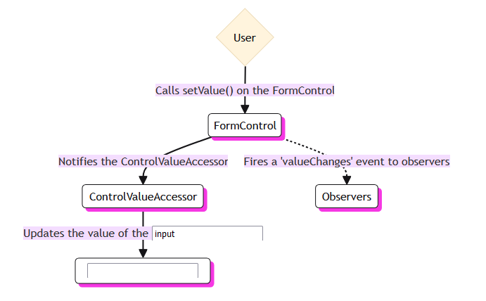

# Forms

*Last Updated : 08/2024 - Angular 18.*

### Summary

- [Overview](#overview)
- [Common base classes](#common-base-classes)
- [Reactive forms](#reactive-forms)
    - [Data flow](#data-flow)
    - [Testing](#testing)
- [Template-driven forms](#template-driven-forms)
    - [Data flow](#data-flow)
    - [Testing](#testing)
- [Reactive vs Template-driven](#reactive-vs-template-driven)
- [Validation](#validation)
    - [Template-driven forms](#template-driven-forms)
    - [Reactive forms](#reactive-forms)
    - [Custom validators](#custom-validators)
    - [Control status CSS classes](#control-status-css-classes)

#
> Source : [Angular official documentation](https://angular.dev/overview).

<br>

## Overview

- Entry point for user inputed data.

- Common workflow :

    - **Captures** user input events from the view.
    - **Validates** the input.
    - Creates a form model and **data model** to update.
    - Provides a way to **track changes**.

- 2 types of forms :

    - **Reactive**.
    - **Template-driven**.

#
### Common base classes

| Base class           | Details                                                                           |
|----------------------|-----------------------------------------------------------------------------------|
| FormControl          | Tracks the **value** and **validation** status of an individual form control.     |
| FormGroup            | Tracks the same values and status for a **collection** of form controls.          |
| FormArray            | Tracks the same values and status for an **array** of form controls.              |
| ControlValueAccessor | Creates a bridge between Angular FormControl instances and built-in DOM elements. |

<br>

## Reactive forms

*Ex :*

``` typescript
import {Component} from '@angular/core';
import {FormControl} from '@angular/forms';

@Component({
    selector: 'app-reactive-favorite-color',
    template: `
        Favorite Color: <input type="text" [formControl]="favoriteColorControl">
    `,
})
export class FavoriteColorComponent {
    favoriteColorControl = new FormControl('');
}
```
#
### Data flow

<div style="display: flex;">
    
    
</div>

<br>

**User input**

- The user types a value into the input element.
- The form input element emits an **input** event with the latest value.
- The `ControlValueAccessor` listening for events on the form input element immediately relays the new value to the `FormControl` instance.
- The `FormControl` instance emits the new value through the `valueChanges` observable.
- Any subscribers to the `valueChanges` observable receive the new value.

<br>

**Programmatic change**

- The program calls the `FormControl.setValue()` method.
- The `FormControl` instance emits the new value through the `valueChanges` observable.
- Any subscribers to the `valueChanges` observable receive the new value.
- The `ControlValueAccessor` on the form input element **updates** the element with the new value.

#
### Testing

- Can be tested synchronously.
- No UI render needed.
- No interaction with the change detection cycle.

*Ex :*

``` typescript
// View-to-Model flow.
it('should update the value of the input field', () => {
    // Creates a custom input element.
    const input = fixture.nativeElement.querySelector('input');
    const event = createNewEvent('input');

    // Sets value.
    input.value = 'Red';
    
    // Sends to the FormControl instance.
    input.dispatchEvent(event);

    expect(fixture.componentInstance.myControl.value).toEqual('Red');
});

// Model-to-View flow.
it('should update the value in the control', () => {
    // Sets value.
    component.myControl.setValue('Blue');
    
    // Creates a custom input element.
    const input = fixture.nativeElement.querySelector('input');

    expect(input.value).toBe('Blue');
});
```
<br>

## Template-driven forms

- Uses the `ngModel` directive to manage a `FormControl` instance for a given form element. 

*Ex :*

``` typescript
import {Component} from '@angular/core';

@Component({
    selector: 'app-template-favorite-color',
    template: `
        Favorite Color: <input type="text" [(ngModel)]="favoriteColor">
    `
})
export class FavoriteColorComponent {
    favoriteColor = '';
}
```
#
### Data flow


<br>


<br>

**User input**

- The user types a value into the input element.
- The form input element emits an **input** event with the latest value.
- The `ControlValueAccessor` listening for events on the form input element immediately relays the new value to the underlying `FormControl` instance.
- The `FormControl` instance emits the new value through the `valueChanges` observable.
- Any subscribers to the `valueChanges` observable receive the new value.
- The `ControlValueAccessor` also calls the `NgModel.viewToModelUpdate()` method which emits an `ngModelChange` event.

Because the component template uses two-way data binding for the property, the property in the component is updated to the value emitted by the `ngModelChange` event.

<br>

**Programmatic change**

- The value field is updated in the component.
- Change detection begins.
- During change detection, the `ngOnChanges` lifecycle hook is called on the `NgModel` directive instance because the value of one of its inputs has changed.
- The `ngOnChanges()` method queues an **async** task to set the value for the internal `FormControl` instance.
- Change detection completes.
- On the next tick, the task to set the `FormControl` instance value is executed.
- The `FormControl` instance emits the new value through the `valueChanges` observable.
- Any subscribers to the `valueChanges` observable receive the new value.
- The `ControlValueAccessor` updates the form input element in the view with the latest value.

#
### Testing

- Depends on change detection.

*Ex :*

``` typescript
// View-to-Model flow.
it('should update the favorite color in the component', fakeAsync(() => {
    const input = fixture.nativeElement.querySelector('input');
    const event = createNewEvent('input');

    input.value = 'Red';
    input.dispatchEvent(event);

    fixture.detectChanges();
    
    expect(component.myField).toEqual('Red');
}));

// Model-to-View flow.
it('should update the favorite color on the input field', fakeAsync(() => {
    component.myField = 'Blue';

    fixture.detectChanges();

    // Simulates the passage of time within the fakeAsync() task.
    tick();

    const input = fixture.nativeElement.querySelector('input');

    expect(input.value).toBe('Blue');
}));
```
<br>

## Reactive vs Template-driven

|	              | Reactive                              |	Template-driven                                      |
|-----------------|---------------------------------------|------------------------------------------------------|
| **Setup**       |	Explicit, created in component class. | Implicit, created by directives.                     |
| **Data model**  |	Structured and immutable.             | Unstructured and mutable.                            |
| **Data flow**   |	Synchronous.                          | Asynchronous.                                        |
| **Validation**  |	Functions.                            | Directives.                                          |
| **Scalability** | Scalable.                             | Not really scalable.                                 |
| **Testing**     | Small setup.                          | Deeply reliant on manual change detection execution. |
| **Reusability** | Reusable across components.           | Not reusable.                                        |
| **Complexity**  | Complex for complex use cases.        | Easy and straightforward for simple use cases.       |

<br>

## Validation

### Template-driven forms

- Native HTML form validation.

- Every time a form control is updated, validation is run and Angular generate a list of validation errors, or null.

- Accesses using `model.hasError()` method.

<br>

*Ex :*

``` html
<input type="text" id="name" name="name" class="form-control"
    required minlength="4" appForbiddenName="bob"
    [(ngModel)]="actor.name" #name="ngModel">

<div *ngIf="name.invalid && (name.dirty || name.touched)" class="alert">
    <div *ngIf="name.hasError('required')">
        Name is required.
    </div>
    <div *ngIf="name.hasError('minlength')">
        Name must be at least 4 characters long.
    </div>
    <div *ngIf="name.hasError('forbiddenName')">
        Name cannot be Bob.
    </div>
</div>
```
#
### Reactive forms

- Validators are added as form control proxies within components.

- Returns a set of error as in template-driven forms.

- Can be **sync** or **async**.

- Native HTML form validators **built-in**.

- Same HTML syntax as in template-driven forms.

<br>

*Ex :*

``` typescript
// ...
name: new FormControl(this.actor.name, [
    Validators.required,
    Validators.minLength(4),
    forbiddenNameValidator(/bob/i)
]);
```

``` html
<input type="text" id="name" class="form-control"
    formControlName="name" required>

<div *ngIf="name.invalid && (name.dirty || name.touched)" class="alert alert-danger">
    <div *ngIf="name.hasError('required')">
        Name is required.
    </div>
    <div *ngIf="name.hasError('minlength')">
        Name must be at least 4 characters long.
    </div>
    <div *ngIf="name.hasError('forbiddenName')">
        Name cannot be Bob.
    </div>
</div>
```
#
### Custom validators

*Ex :*

``` typescript
export function forbiddenNameValidator(nameRe: RegExp): ValidatorFn {

    return (control: AbstractControl): ValidationErrors | null => {
        const forbidden = nameRe.test(control.value);
        return forbidden ? {forbiddenName: {value: control.value}} : null;
    };
}
```
#
### Control status CSS classes

- Overrride in a `form.css` asset file imported into the main html file.

- Classes :

  - `ng-valid`
  - `ng-invalid`
  - `ng-pending`
  - `ng-pristine`
  - `ng-dirty`
  - `ng-untouched`
  - `ng-touched`
  - `ng-submitted` (enclosing form element only).
