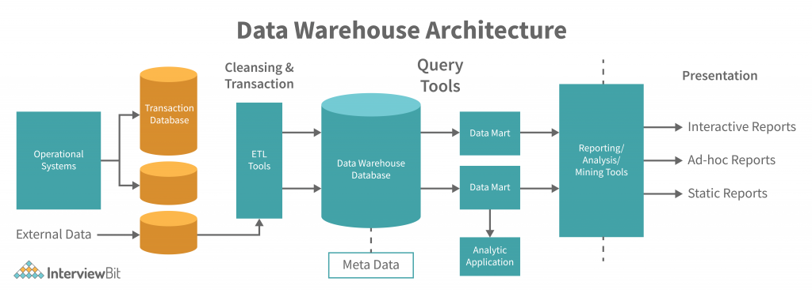
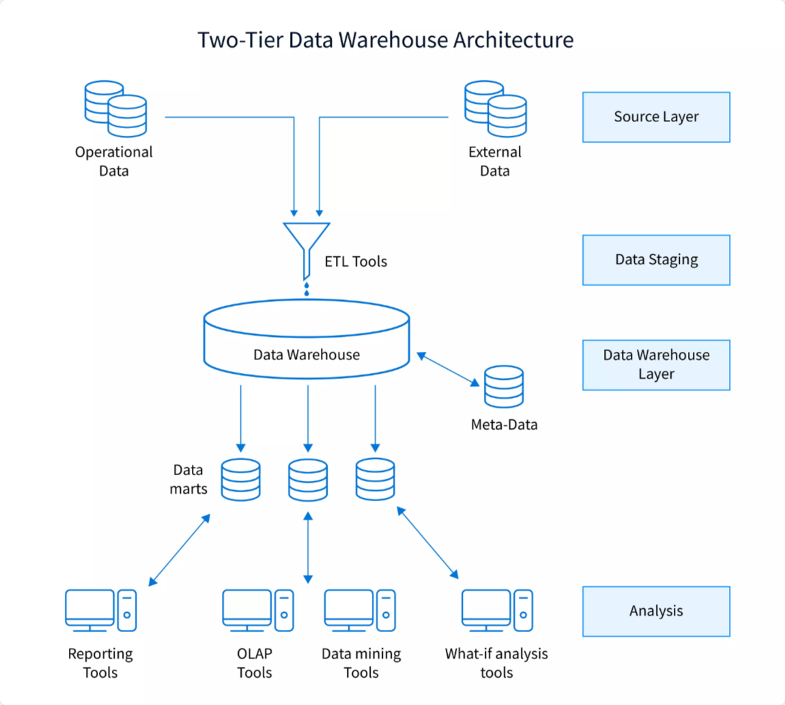

# Concepts

## Data Warehouse

**Central repository** of integrated data from **one or more disparate sources**, from all time periods, for <u>reporting</u> and <u>data analysis</u>.

It is considered a core component of **business intelligence**.

## Architecture

 

 

Data from various operational systems : sales, ERP, CRM, CMS... is stored in their own dedicated transactional databases within their own achitecture.

This data is regularly extracted and sent into the warehouse itself through a Data Staging process which can take 2 forms :

### Extract-Transform-Load (ETL)

System or processes to extract data from outside sources, transform (clean, sanitize, format) and load into a repository. The process can be as simple as loading and parsing a .csv to add data.

### Extract-Load-Transform (ELT)

Data pipeline model.
Alternative to ETL where the data is directly loaded into a **data lake**, in its original form.

**<u>Advantages</u>** : 

- Faster loading-time.
- No schema need to be specified.

**<u>Issues</u>** :

- The lake must enable a fast enough processing engine to transform the data on demand.

### Data lake

Repository of data stored in natural / raw format, like :

- Structured data from relational databases (rows and columns).
- Semi-structured data (CSV, logs, XML, JSON).
- Unstructured data (emails, documents, PDF).
- Binary data (images, audio, video).

Data lake provides a central repository for grouped data. 

Ex : personal data of individual users with text, files, emails...

Cloud Storage Services often use data lakes.

---

 

The data is then loaded, transformed or not, into the warehouse. A metadata external DB can be directly liked to it.

### Data Warehouse

**<u>Advantages</u>**

- Integrates data from multiple sources into a single database and data model. A single query engine can be used to present data in an ODS.

- Maintains a copy of information from the source transaction systems. Maintains data history, even if the source transaction systems do not.

- Enables a central view across the company. This benefit is always valuable, but particularly so when the organization has grown by merger.

- Can improve data quality by providing consistent codes and descriptions, flagging or even fixing bad data.

- Restructures the data so that it delivers good query performance, even for complex analytic queries, without impacting the operational systems.

- Adds value to operational business applications, notably customer relationship management (CRM) systems.

- Make decision–support queries easier to write.

- Organize and disambiguate repetitive data.

### Data Analysis

The main purpose of a warehouse is to provide efficient data analysis tools.

### Data Mart

A **datamart** (or data mart, for "data market") is a simple form of warehouse focused on a single subject or functional area. A sort of miniature warehouse dedicated to a certain type of data from a restreint number of external sources.

|                     | Data Warehouse | Data Mart       |
|---------------------|----------------|-----------------|
| Scope of data       | company-wide   | department-wide |
| Subject of the data | multiple       | single          |
| Difficulty to build | difficult      | easy            |
| Time to build       | more           | less            |
| Memory usage        | large          | limited         |
| Access to data      | harder         | easier          |

 

Datamarts use a dimensional model and common **design schemas** : //TODO

- **Star schema**.
- **Snowflake schema**.
- **Activity schema**.

