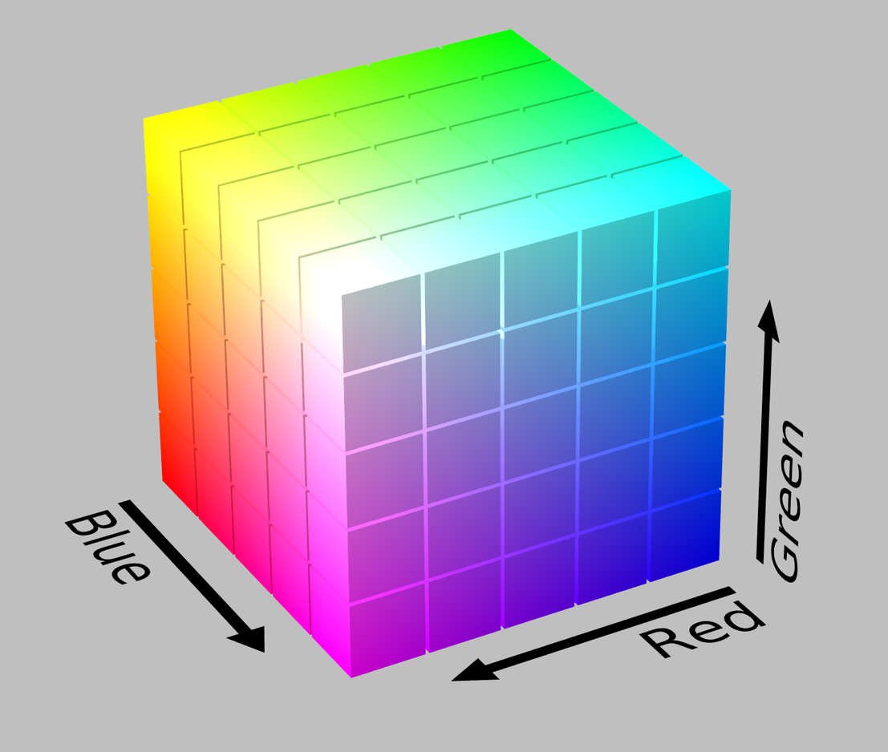
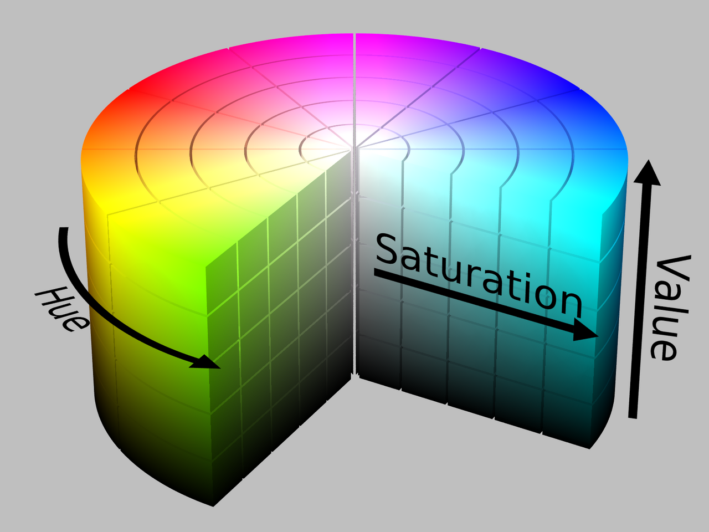

# Color Spaces

*Last Updated : 05/2024.*

### Summary

- [Hue - Saturation - Value (HSV) Model](#hue---saturation---value-hsv-model)
	- [RGB to HSV](#rgb-to-hsv)
	- [HSV to RGB](#hsv-to-rgb)

#
> Source : Wikipedia.

<br>

## Hue - Saturation - Value (HSV) Model

- One of the 2 commons **cylindrical models** for color representation.

- Transformation from the RGB model, can be **converted** from and to it.

<br>

**RGB cube model** :



<br>

**HSV cylinder model** :



<br>

- **<u>Hue</u>** : the angular coordinate of the color on the scale.

- **<u>Saturation</u>** : the color **intensity**. 0 is white and 1 is the maximum intensity.

- **<u>Value</u>** : the color **brightness**. 0 is black and 1 is the brightest.

#
### RGB to HSV

Visual representation :

<video width="400" height="300" controls preload="none" poster="assets/col_rgb-hsv.jpg">
	<source src="assets/col_rgb-hsv.mp4" type="video/mp4">
</video>

<br>

**Algorithm**

```
// Chroma
M = max(R, G, B)
m = min(R, G, B)
C = range(R, G, B) = M - m

// Hue
if C = 0 :  H' = undefined
if M = R :  H' = ((G - B) / C) mod 6
if M = G :  H' = ((B - R) / C) + 2
if M = B :  H' = ((R - G) / C) + 4

H = H' * 60

// Value
V = M

// Saturation
if V = 0 :  S = 0
else :      S = C / V

return (H, S, V)
```
#
### HSV to RGB

**Algorithm**

```
// Chroma
C = V * S

H' = H / 60
X = C * (1 - |H' mod 2 - 1|)

if 0 <= H' < 1 :  (R', G', B') = (C, X, 0)
if 1 <= H' < 2 :  (R', G', B') = (X, C, 0)
if 2 <= H' < 3 :  (R', G', B') = (0, C, X)
if 3 <= H' < 4 :  (R', G', B') = (0, X, C)
if 4 <= H' < 5 :  (R', G', B') = (X, 0, C)
if 5 <= H' < 6 :  (R', G', B') = (C, 0, X)

m = V - C

// Scaling
R = R' + m
G = G' + m
B = B' + m

return (R, G, B)
```