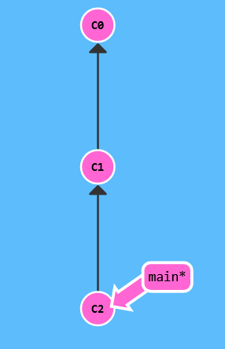
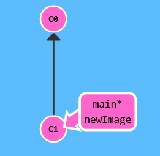

# Git Branching

### Summary

- [Git](#git)
- [Repositories](#repositories)
    - [Init](#init)
    - [Clone](#clone)
- [File Tracking](#file-tracking)
    - [Patching](#patching)
    - [Moving and renaming](#moving-and-renaming)
- [Commits](#commits)
    - [HEAD](#head)
    - [Referencing commits](#referencing-commits)
    - [Canceling changes](#canceling-changes)
    - [Amending changes](#amending-changes)
- [Branches](#branches)
    - [Moving branches in the tree](#moving-branches-in-the-tree)
    - [Renaming branches](#renaming-branches)
    - [Tags](#tags)
- [Commits Movements](#commits-movements)
    - [Merge](#merge)
    - [Cherry Pick](#cherry-pick)
    - [Rebase](#rebase)
- [Advanced Operations](#advanced-operations)
    - [Bisect](#bisect)
    - [Describe](#describe)
    - [Reflog](#reflog)
- [Remote Work](#remote-work)
    - [Remote-tracking branches](#remote-tracking-branches)
    - [Synchronization](#synchronization)

#
> Learning tool for Git & base material for this document : [Learn Git Branching](https://learngitbranching.js.org) + [interactive sandbox environment](https://learngitbranching.js.org/?locale=fr_FR&NODEMO=).

<br>

## Git 

- **Version control tool** for projects.

- Holds project files inside a **repository**.

- Keeps track of changes in files inside a **tree**.

- Powerful tool to track, modify, synchronize and qualify **changes** in code.

- Allows large teams to **collaborate** on projects.

<br>

## Repositories

- A project is held inside a **repository** as a **tree**.

- Can be stored **locally** on a single machine, or **remotely** on servers.

<br>

**Local Repositories** :

- Differs from the project working directory.

- Held inside a `.git` folder inside the current working directory, that will keep track of changed files and hold the tree.

<br>

**Remote Repositories** :

- Project repository is hosted on the **cloud**.

- Allows for **collaborative** work.

- Enables **CI/CD** through API access.

- Work done and committed on a local repository. 

- Changes then pushed to the remote repository and synced with the global work.

- Common hosts : **[Github](https://github.com)**, **[GitLab](https://about.gitlab.com)**.

<br>

Example of repository tree :


<br>

A git **tree** is a non-binary tree. Each node of the tree is a **commit**. A commit only refers to one parent. 

All leaves of the tree are referenced as **branches**. A branch can be seen as a succession of commits from a diverging point onwards.

When staging the changes made to the files, a new commit is created and added after the currently selected commit (which is usually the latest, but not necessarily).
As such, one of the commit of the tree is always "selected" as current. Its reference is called the **HEAD**.

Git provides powerful tools to manipulate the commit tree.

#
### Init

- A local repository needs to be instantiated.

- Initializes an empty git repository by creating the `.git` folder.

- Creates a **default** branch (usually named `main`) and checks it out.

<br>

> `git init` 

#
### Clone

- Clones the data from a remote repository (can be from another local directory as well) into the local repository :

    - References the remote repository as `origin`.
    - Pulls down all data from the remote repository's **default** branch.
    - Creates a remote branch referencing the remote repository's default branch, named `<remote>/<default_branch_name>` (usually `origin/main`).
    - The local default branch now points to the same commit as the remote branch.

<br>

> `git clone <url>`

<br>

## File Tracking

A modified file is flagged as '**untracked**' and not present inside the `.git` directory.

Before changes can be committed, they need to be tracked and added inside the `.git` directory.

- Adding all untracked files :

> `git add .`

- Adding only a specific file :

> `git add <file_path>`

- Adding only a specific file :

> `git add <file_path>`

- Untracking a previously tracked file :

> `git restore <file_path>`

#
### Patching

- Subcommand to only add **hunks** (parts) of changes inside a file.

- Opens a CLI to display and manipulate hunks within the file :

    - `y` : accepts and tracks the hunk.
    - `n` : ignores the hunk.
    - `s` : splits the current hunk into smaller hunks to process.
    - `q` : saves & quits, ignoring subsequent hunks.

<br>

If all hunks have been reviewed, the CLI automatically saves & quits.

> `git add -p <file_path>` - Starts patching a specific file.

> `git reset -p <file_path>` - Start removing patches in a specific file.

#
### Moving and renaming

- Files can be moved or renamed as a whole : in the git repository and the working directory simultaneously.

- No `--cached` subcommand.

- Moving a file or renaming is the same action :

> `git mv <old_path> <new_path>` - Where the path is the complete relative path of the file.

- This is a shorthand for :

> `git add <new_path>`

> `git rm <old_path>`

- Renaming is just moving to the same place a file with different name.

<br>

## Commits

- Nodes of the tree.

- Holds a **snapshot** of the repository at a given time, relative to a *previous version* of the repository.

- Only stores the *changes* ("**deltas**"), which makes it *lighter* than a whole copy of the repository.

- Before a change can be committed, it must first be **tracked** inside the repository.

- If no changes have been made and tracked, no commit is made.

<br>

The first commit consider all the files to be deltas, thus commiting the whole repository.

*Ex :*



<br>

- `C0` is the first commit.
- `C1` is the parent commit of `C2`.
- `C2` is a new commit which has changes from the previous one.
- The branch `main` is currently positionned at `C2`.
- The HEAD points at the branch `main`.

<br>

A commit generates an unique identifier by hashing its content and the commit message if provided, in *sha256*.

> `git commit` - Creates a commit.

> `git commit -m '<commit_description>'` - Creates a commit with a description.

#
### HEAD

- Symbolic name of the **current commit** in the tree.

- Can be different from the commit a branch points to.

- Commonly points to the latest commit, *effectively* pointing towards the same commit as the branch.

- Can reference a commit anywhere in the tree, even in another branch.

#
### Referencing commits

- Full commit hash :

> `git checkout <commit_hash>` - Moves the HEAD at the specific commit in the tree.

- Relative reference to last commit :

> `git checkout HEAD^` - Moves the HEAD one commit behinds (its parent).

> `git checkout HEAD^^` - Moves the HEAD 2 commit behinds.

> `git checkout HEAD^^^` - etc.

- Relative reference to nth last commit :

> `git checkout HEAD~n` - Moves the HEAD n commit behinds in the branch.

<br>

Commit references will be written using the `ref` keyword.

#
### Canceling changes

- `reset`

Moves the HEAD (that is usually the branch) to the specified commit or x commit behind. The subsequent commits never happened.

> `git reset <ref>`

<br>

- `revert`
        
Throwing away commits can be dangerous for remote branches.

Creates a new commit that records the **reverse changes** of the target commit and **all** its children. This commit can be pushed to a remote repository, effectively cancelling the changes without deleting any commit.

> `git revert <ref>`

<br>

- `rm`

Uncommits a committed file (remove from `.git` repository only) :

> `git rm --cached <file_path>`

#
### Amending changes

- The last commit can be rewritten using subcommands :

> `git commit --amend` - Adds newly tracked files to the last commit and changes the last commit message.

> `git commit --amend --no-edit` - Adds newly tracked files without changing the last commit message.

<br>

A change in files or commit message **generates a new signature** : `--amend` doesn't actually change the last commit **in-place**. It creates a new commit and delete the previous one.

<br>

## Branches

- Simple **reference** to a specific commit of the tree (and by extension all its parents).

- When a new commit is added to the tree, simply **updates** the reference.

- **Time & memory cost free**.

- Each repository possesses a **default** branch.

<br>

> `git branch <branch_name>` - Creates a new branch referencing the HEAD.

> `git checkout <branch_name>` - Changes the current branch to an already existing one.

> `git checkout -b <branch_name>` - Creates a new branch and switches to it.

*Ex :*



<br>


<br>

- The branch `newImage` is created from `C1`.
- The new branch is checked out and `C2` is committed on the branch.

<br>


<br>

- The branch `bugFix` is created from `C1` and checked out.
- `C2` is committed on the branch.
- The branch `main` is checked out.
- `C3` is committed on the branch.

#
### Moving branches in the tree

> `git branch -f <branch_name> HEAD~3` - The branch now references a commit 3 commits behind HEAD.

#
### Renaming branches

> `git branch -m <old_name> <new_name>` - Moves the branch name, config and reflog into a new branch.

#
### Tags

- **Permanent references** to specifics commits. unlike branches that moves as commits are added.

- Mostly used for **releases** & **versions**.

<br>

> `git tag <tag_name>` - Tags the HEAD.

> `git tag <tag_name> <ref>` - Tags a specific commit.

<br>

## Commits Movements

### Merge

- Combines commits from a target branch into the current branch.

<br>

> `git merge <target_branch>`

*Ex :*


<br>

- `bugFix` has been merged into `main`.
- Its commit `C3`is now part of `main`, and both branches points to the same commit.

#
### Cherry Pick

- Takes a commit from another branch and copies it into the current branch.

<br>

> `git cherry-pick <ref>`

*Ex :*


<br>

- `C2` has been cherry picked into main.
- The branch `bugFix` did not change.

#
### Rebase

- One of the most powerful tools.

- Takes a commit and all its children (**subtree**) and copy them at the commit referenced by another branch.

- **Alternative** to `merge`, that can be cleaner in logs.

<br>

> `git rebase <target_branch || ref>` - Rebases subtree from the target branch into the current branch.

*Ex :*


<br>

- `bugFix` has been rebased into main.
- The whole subtree has been added as a child of `main`.

<br>

## Advanced Operations

### Bisect

- **Binary search operation** on commits.

- Used to quickly find specific commits introducing **bugs** or **features**.

- Search is performed between 2 commits that are flagged with a couple of **terms**.

<br>

> `git bisect start` - Starts a bisect session.

> `git bisect reset` - Ends the session and returns to the HEAD.

> `git bisect reset <ref>` - Ends the session and returns to the specified commit.

Built-in terms : 

- `good` / `bad`.
- `old` / `new` .

Terms from different couples cannot be mixed.

Defining custom terms (excluding already-in-use subcommands) :

> `git bisect start --term-old <term_old> --term-new <term_new>`

*Ex :*

``` bash
$ git bisect start
$ git bisect bad                 # Current version is bad.
$ git bisect good v2.6.13-rc2    # Tag v2.6.13-rc2 is known to be good.

$ > Bisecting: 675 revisions left to test after this (roughly 10 steps)
```
Now the current version is at a commit in-between. After compiling and testing, the process can be repeated :

If the version is broken :

    $ git bisect bad

If it's good :

    $ git bisect good

When no revision is left to test, the output prints a description of the commit found.

#
### Describe

- Outputs the number of commits from the **last created tag** to the specified commit.

- Outputs in the form : `<tag_name>_<nb_of_commits>_g<commit_hash>`

- If the commit is the tag, only outputs the tag name.

<br>

> `git describe <ref>`

#
### Reflog

- Print reference records of changes in the current branch.

<br>

> `git reflog`

*Ex :*

``` bash
fe19ce5 (HEAD -> main, origin/main, origin/HEAD) HEAD@{0}: commit: <message>
789ee99 HEAD@{1}: commit: <message>
dcdae73 HEAD@{2}: commit: <message>
1427092 HEAD@{3}: checkout: moving from f20d16dcc0507a87cf59044184a56dcff3f0fcdf to main
9cb6ead HEAD@{4}: commit: <message>
f3d7de9 HEAD@{5}: commit: <message>
```
- Shows shortened commit **SHA** along with their distance from the HEAD and message.
- HEAD, main, origin/main and origin/HEAD points to the same commit.

<br>

## Remote Work

### Remote-tracking branches

- **Reference** to the state of branches in the remote repository, within the local repository.

- Formatted as `<remote>/<branch_name>` (ex : `origin/main`).

- Can be checked out to access remote state of the tree.

- Local branch can usually only update a remote branch with the **same name**.

- HEAD is **detached** from the branch. Local commits will not update the branch reference as only changes made through the remote repository can.

<br>

*Ex :*


<br>


<br>

- The remote repository (on the right) has been cloned as `o`, and a remote-tracking branch has been created, named `o/main`.
- A commit `C2` has been made on `o/main`. Only HEAD has moved.

#
### Synchronization

If the remote repository is updated, a difference will appear between the remote tracking branch and the local branch.

Before pushing to the remote repository, a **synchronization** between remote and local is needed as the changes can conflict between each other.

*Ex :*


<br>

- `C2` has been committed on the remote repository by someone else.
- `C3` has been committed locally on the branch `main`.
- The remote-tracking branch `o/main` is still at `C1`.


