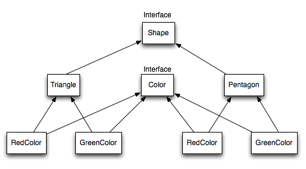

# Design Patterns

*Last Updated : 01/2024 - Java 21.*

### Summary

- [Overview](#overview)
- [Creational Design Patterns](#creational-design-patterns)
    - [Singleton](#singleton)
    - [Factory](#factory)
    - [Abstract Factory](#abstract-factory)
    - [Builder](#builder)
    - [Prototype](#prototype)
- [Structural Design Patterns](#structural-design-patterns)
    - [Adapter](#adapter)
    - [Composite](#composite)
    - [Proxy](#proxy)
    - [Flyweight](#flyweight)
    - [Facade](#facade)
    - [Bridge](#bridge)
    - [Decorator](#decorator)
- [Behavioral Design Patterns](#behavioral-design-patterns)
    - [Template Method](#template-method)
    - [Mediator](#mediator)
    - [Chain of Responsibility](#chain-of-responsibility)
    - [Observer](#observer)
    - [Strategy](#strategy)
    - [Command](#command)
    - [State](#state)
    - [Visitor](#visitor)
    - [Interpreter](#interpreter)
    - [Iterator](#iterator)
    - [Memento](#memento)
- [Miscellaneous Design Patterns](#miscellaneous-design-patterns)
	- [Data Access Object (DAO)](#data-access-object-dao)
	- [Dependency Injection](#dependency-injection)
	- [Model-View-Controller (MVC)](#model-view-controller-mvc)

#
<br>

## Overview

- Solutions to common **design problems**.

- **Robusts**.

- Part of industry **standards**.

- **Reusables**.

<br>

## Creational Design Patterns

### Singleton

Restricts the instantiation of a class and ensures that only one instance of the class exists in the JVM.

#
### Factory

Used when a superclass has multiple subclasses and based on input, we need to return one of the subclasses. This pattern takes out the responsibility of the instantiation of a class from the client program to the factory class. 

We can apply a singleton pattern on the factory class or make the factory method static.

#
### Abstract Factory

Factory of factories. Consists of a factory class for each subclass and then an abstract factory class that will return the subclass based on the input factory class.

#
### Builder

Introduced to solve some of the problems with Factory & Abstract Factory design patterns when the object contains a lot of attributes. 

This pattern solves the issue with a large number of optional parameters and inconsistent state by providing a way to build the object step-by-step and provide a method that will actually return the final Object.

``` java
private Computer(ComputerBuilder builder) {
    this.HDD = builder.HDD;
    this.RAM = builder.RAM;
    this.isGraphicsCardEnabled = builder.isGraphicsCardEnabled;
    this.isBluetoothEnabled = builder.isBluetoothEnabled;
}

Computer comp = new Computer.ComputerBuilder("500 GB", "2 GB")
	.setBluetoothEnabled(true)
	.setGraphicsCardEnabled(true)
	.build();
```
#
### Prototype

Used when the Object creation is costly and requires a lot of time and resources, and a similar Object already exists. 

This pattern provides a mechanism to copy the original Object to a new Object and then modify it according to our needs. 

- Uses Java cloning to copy the Object. 
- The copied Object should provide the copying feature. 
- It should not be done by any other class.

However, whether to use the shallow or deep copy of the object properties depends on the requirements and is a design decision.

``` java
public class Employees implements Cloneable {

    private List<String> employeesList;
	// ...
	@Override
	public Object clone() throws CloneNotSupportedException {
		// ... // Copy list.
		return new Employees(temp);
	}
}

// Example of result.
/*
employeesList: [Pankaj, Raj, David, Lisa]
employeesList1: [Pankaj, Raj, David, Lisa, John]
employeesList2: [Raj, David, Lisa]
*/
```
<br>

## Structural Design Patterns

### Adapter

Joins unrelated interfaces.

#
### Composite

When creating a structure in a way that the objects in the structure has to be treated the same way.

Ex : A diagram is a structure that consists of Objects such as Circle, Lines, Triangle etc. 

When the drawing gets filled with color, the same color also gets applied to the Objects in the drawing. Here drawing is made up of different parts and they all have same operations. Composite Pattern consists of following objects.

- **Base Component** - Interface or Abstract class for all objects in the composition.
- **Leaf** - Defines the behaviour for the elements in the composition. It is the building block for the composition and implements base component. It doesn’t have references to other Components.
- **Composite** - Consists of leaf elements and implements the operations in base component.

#
### Proxy

Provides a placeholder for another Object to control access.

``` java
public class CommandExecutorProxy implements CommandExecutor {

	private boolean isAdmin;
	private CommandExecutor executor;
	
	public CommandExecutorProxy(String user, String pwd) {
		if("aaa".equals(user) && "pwd".equals(pwd)) isAdmin=true;
		executor = new CommandExecutorImpl();
	}
	
	@Override
	public void runCommand(String cmd) throws Exception {

		if (isAdmin) {
			executor.runCommand(cmd);
		} else {
			if (cmd.trim().startsWith("rm")) {
				throw new Exception("rm command is not allowed for non-admin users.");
			} else {
				executor.runCommand(cmd);
			}
		}
	}
}
```
#
### Flyweight

Reduce the load on memory by sharing Objects, only creating them when not already instantiated.

Used when a lot of Objects of a Class have to be created. Since every Object consumes memory space that can be crucial for low-memory devices (such as mobile devices or embedded systems);

Ex : **Java String pool**.

#
### Facade

Detaches the a component to its implementations (DB connections, business logic...).

#
### Bridge

When interfaces have hierarchies in both interfaces as well as implementations, used to decouple the interfaces from the implementation and to hide the implementation details from the client programs. 

The implementation follows the notion of preferring composition over inheritance.



<br>


<br>

#
### Decorator

Modifies the functionality of an individual object at runtime. Other instances are not affected.

``` java
Car sportsLuxuryCar = new SportsCar(new LuxuryCar(new BasicCar()));
sportsLuxuryCar.assemble();
```
<br>

## Behavioral Design Patterns

### Template Method

Creates a method stub that defines the steps to execute an algorithm, and defers some of the steps of implementation to the subclasses.

``` java
public abstract class HouseTemplate {

	public final void buildHouse() {
		buildFoundation();
		buildPillars();
		buildWalls();
		buildWindows();
	}

    private void buildFoundation() {
        // Default implementation.
	}

	private void buildWindows() {
        // Default implementation.
	}

	public abstract void buildWalls();
	public abstract void buildPillars();
}
```
#
### Mediator

Provides a centralized communication medium between different objects in a system. 

If the objects interact with each other directly, the system components are tightly-coupled with each other which makes maintainability cost higher and not flexible to extend easily. 
<br>
The mediator pattern focuses on providing a mediator between objects for communication and implementing **loose-coupling** between objects. 

The mediator works as a router between objects, and it can have its own logic to provide a way of communication.

#
### Chain of Responsibility

Used to achieve loose-coupling when a request from the client is passed to a chain of objects to process them. 

The current object in the chain will decide who will be processing the request and whether the request is required to be sent to the next object in the chain or not.

Ex : multiple catch blocks in a try-catch block code. Every catch block is a processor to process a particular exception. 
When an exception occurs in the try block, it’s sent to the first catch block to process. If the catch block is not able to process it, it forwards the request to the next object in the chain (i.e., the next catch block). If even the last catch block is not able to process it, the exception is thrown outside of the chain to the calling program.

#
### Observer

Watches the state of an Object and notify on change through a Subject.

#
### Strategy

Let the client decide the actual method implementation to be used at runtime.
Also known as a **policy pattern**.

Ex : `Collections.sort()` method that takes the Comparator parameter. Sorts differently based on the different implementations.

#
### Command

Used to implement **loose-coupling** in a request-response model. 

The request is sent to an invoker which passes it to the encapsulated command object. The command object passes the request to the appropriate method of receiver to perform the specific action.

#
### State

State variable in an object to handle state changes.

#
### Visitor

Used when performing an operation on a group of similar kinds of objects.
Move the operational logic from the objects to another class.

#
### Interpreter

Provides an interpreter to deal with a grammatical representation of a language.

#
### Iterator

Provides a standard way to traverse through a group of objects.

Ex : Java Iterator interface.

#
### Memento

Saves the state of an object so that it can be restored later on. 

The saved state data is not accessible outside of the object, protects integrity.

<br>

## Miscellaneous Design Patterns

### Data Access Object (DAO)

Decouples the data persistence logic to a separate layer. Keep the service layer separate from the data access layer.

#
### Dependency Injection

Instantiates a class one time (with a *Singleton* for instance) and injects it into classes that depends on it, instead of instantiating a new class each time.

#
### Model-View-Controller (MVC)