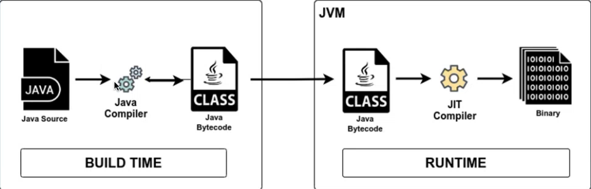
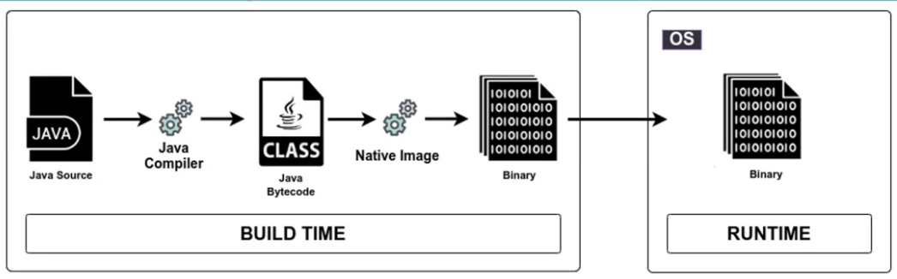
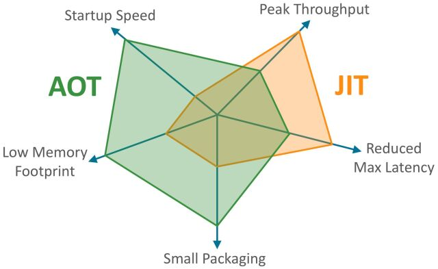
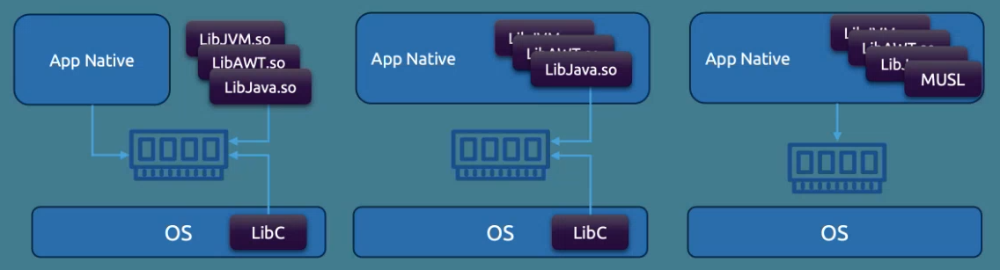

# Native Java

### Summary

- [Traditional Java structure](#traditional-java-structure)
- [Native Java structure](#native-java-structure)
- [New usages](#new-usages)
- [New solutions](#new-solutions)
- [Use cases](#use-cases)

## Traditional Java structure

*Write Once, Run Everywhere.*

A traditional Java application is compiled **Just-In-Time** : 

 

The **bytecode** is compiled at runtime using the **<u>JIT compiler</u>**.
The JIT compiler recompiles on the fly when execution path changes.
 
The JVM adapts to the end machine OS and CPU architecture (the **platform**) and allows a Java program to run regardless of the platform implementation.

**<u>Advantages</u>** :

- Platform independence.
- Optimized performances on the long run.
- Fast build time.
- Low build memory usage.

**<u>Issues</u>** :

- High boot time : loads JVM, loads code, framework elements, classes...
- High CPU usage : JVM adds a layer between the code and the CPU.
- High memory footprint :
    - Garbage collector
    - VM 
    - JIT compiler optimizing performances on the fly.

 

## Native Java structure

A **native program** is platform specific. It can only runs on certain OS or CPU architectures.

A native Java application is compiled **Ahead-Of-Time** : 

 

The app is built and run to load the cache and all classes. A snapshot is made and assembled into a native image towards a binary that can be directly interpreted by the end machine.

Everything not detected as used is <u>excluded from the final image</u>.
This means that *all* dynamic concepts of Java are ignored :

- Spring annotations
- Reflexion
- Serialization
- Classpath

Without a virtual machine, the app is therefore dependent from the Platform it has been compiled on, like a Docker image on linux for instance.

**<u>Advantages</u>** :

- Fast boot time : everything is already packaged.
- Low CPU usage.
- Low memory footprint no VM, no GC.

**<u>Issues</u>** :

- No access to dynamic features.
- Platform dependence.
- Still less performant than JIT compiled program.
- Very long build time (4-6x longer).
- High memory usage when compiling (often > 32Go RAM). Can be problematic when running build jobs in parallel.

 

 

## New usages

**The cloud** :

- Pay-by-uptime.
- Scale at 0 (serverless, function as a service) : boot-and-stop on demand.

 

> Needs fast start time, high performances, low memory foorprint.

 

## New solutions

**Oracle's GraalVM** :

Advanced JDK - Offers support for native Java applications.

**Metadata agent** :

Solves the problem of dynamic features.
It retreives all execution paths and add them into the compiler as metadata.

**Static links** :

Necessary libraries can be added as static links. They are bundled within the image, reducing the OS adherence partially or totally (can run a Docker container from scratch).

| Dynamic                      | Semi-static                     | Static                       | 
|:----------------------------:|:-------------------------------:|:----------------------------:|
|______________________________|_________________________________|______________________________|

 

## Use cases

**Native applications** are best to be used in the following context :

- Small perimeter.
- Easy to test.
- Low dependencies.
- Single platform.

