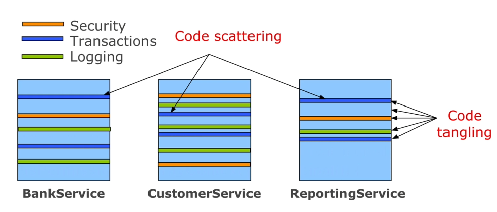
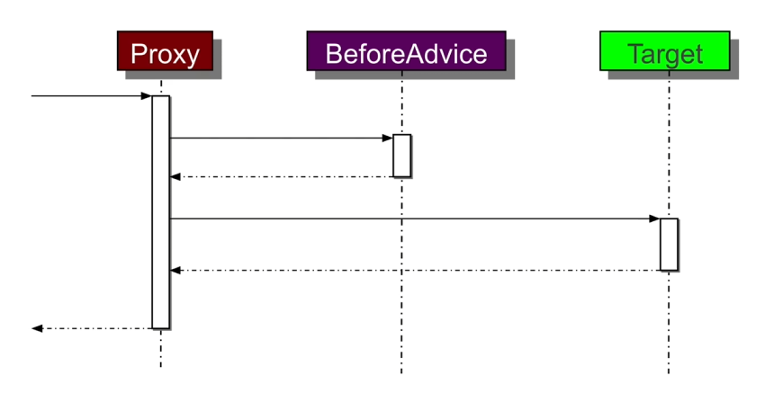
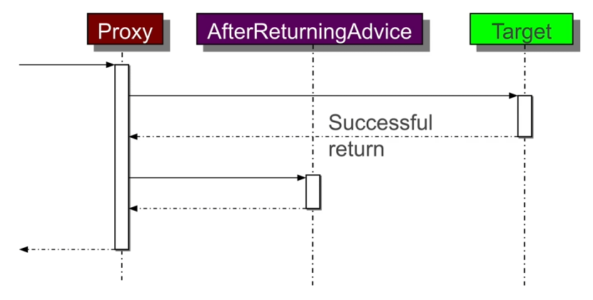
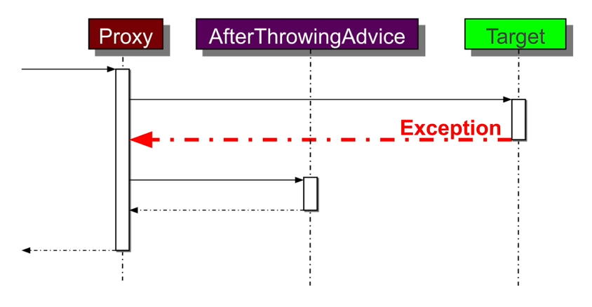
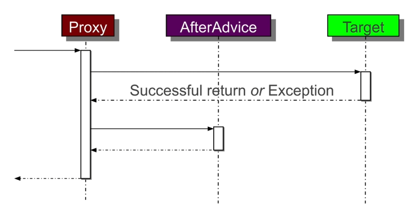
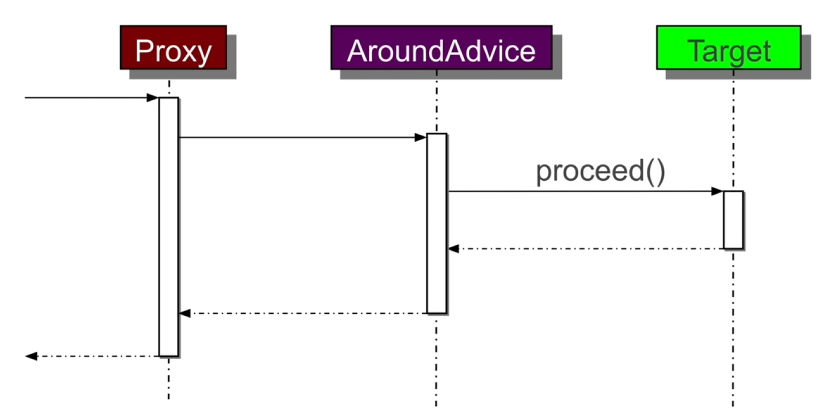

# Aspect-Oriented Programming (AOP)

*Last Updated : 05/2024 - Spring 6.2 - Spring Boot 3.4.*

### Summary

- [Overview](#overview)
    - [Java technologies](#java-technologies)
    - [Limitations of Spring AOP](#limitations-of-spring-aop)
- [Cross-Cutting Concerns](#cross-cutting-concerns)
    - [Code tangling](#code-tangling)
    - [Code scattering](#code-scattering)
- [Core Concepts](#core-concepts)
- [Pointcut Designators](#pointcut-designators)
- [Advice Types](#advice-types)
    - [Before](#before)
    - [After Returning](#after-returning)
    - [After Throwing](#after-throwing)
    - [After](#after)
    - [Around](#around)

#
> Main sources : [Spring Academy Courses](https://spring.academy/home), [documentation](https://spring.io/projects/spring-framework).

<br>

## Overview

- Enables modularization of **cross-cutting concerns** (CCC).

- Gathers code in a single place / module.

- Avoids code **tangling** & **scattering**.

- Implementing AOP :

    - Write business logic.
    - Finds & list CCCs.
    - Write **aspects**.
    - Weave **aspects** to the right places.

- Implementations exist for most languages.

#
### Java technologies :

- **AspectJ** :

    - Original AOP technology (1995).
    - Full-blown AOP language.
    - Weaves by injecting bytecode in the class when loaded into the classloader.

- **Spring AOP** :

    - Java-based framework with **AspectJ** integration.
    - Introduces limitations from **AspectJ**, but enough in 90% of cases.
    - Uses dynamic proxies for weaving.

#
### Limitations of Spring AOP

- Can only advise *non-private* methods.

- Can only apply aspects to **beans**, because proxies are initialized at start by the bean factory.

- **Inner method calls** will not be advised.

- **AspectJ** does not have these limitations.

<br>

## Cross-Cutting Concerns

- Generic functionality or behavior spanning across multiple part of an application, such as :

    - **Logging & Tracing.**
    - **Transaction Management.**
    - **Security.**
    - **Caching.**
    - **Error Handling.**
    - **Performance Monitoring.**
    - **Custom Business Rules.**

<br>

Implementing CCCs without **modularization** leads to code **tangling** and code **scattering**.



<br>

#
### Code tangling

- Coupling of concerns.

*Ex :*

``` java
public class RewardNetworkImpl implements RewardNetwork {
    // ...
    public RewardConfirmation rewardAccountFor(Dining dining) {

        // Security-related code.
        if(!hasPermission(SecurityContext.getProfile())) {
            throw new AccessDeniedException();
        }

        // Business logic.
        Account account = accountRepository.findByCreditCard(dining.getCreditCardNumber());
        Restaurant restaurant = restaurantRepository.findByMerchantNumber(dining.getMerchantNumber());
        MonetaryAmount amount = restaurant.calculateBenefitFor(account, dining);
        // ...
    }
}
```
- The concern (here *security*) is integrated within the method.
- Testing the method will require to implement or mock security somehow.

#
### Code scattering  

- The Concern is replicated across modules, usually in the form of *duplicated code*.

*Ex :*

``` java
// Security-related code.
if(!hasPermission(SecurityContext.getProfile())) {
    throw new AccessDeniedException();
}
// ...   
```
- This access check must be replicated across all required classes & methods.
- Changing the implementation is cumbersome.
- Could lead to slightly different implementations across modules.

<br>

## Core Concepts

**<u>Join Point</u>**

- A point in the execution of a program such as a **method call** or **exception thrown**.
- Spring AOP only allows for method calls as **join points**.
- Contains the context of the method currently executed.

**<u>Pointcut</u>**

- Expression that selects 1 or more **join points**.
- Executes an advice.
- Defines "*where we want to execute*".

**<u>Advice</u>**

- Code to be executed at each selected **join point**.
- Defines "*what we want to execute*".

**<u>Aspect</u>**

- Module encapsulating **pointcuts** and **advices** definitions.

**<u>Weaving</u>**

- Technique by which aspects are combined with main code.

**<u>Proxy</u>**

- Enhanced class standing in place of the original with extra behavior aspects added (woven) into it.

<br>

*Ex :*

``` java
@Aspect
@Component
public class PropertyChangeTracker {
    private Logger logger = Logger.getLogger(getClass());

    @Before("execution(void set*(*))")
    public void trackChange(JoinPoint point) {
        String methodName = point.getSignature().getName();
        Object newValue = point.getArgs()[0];

        logger.info("Property about to change...");
    }
}
```
- `@Aspect` defines a bean as aspect.
- `trackChange` is an advice.
- The join point provides information about the tracked method.
- `@Before("execution(void set*(*))")` defines a pointcut on the `Before` advice.

<br>

Configuring Spring to recognize and use aspects :

``` java
@Configuration
@EnableAspectJAutoProxy
@ComponentScan(basePackages="com.example.aspects")
public class AspectConfig {
    // ...
}
```
- The **AspectJ** weaver is not used and the **Spring AOP** Proxy weaver is used instead.

<br>

## Pointcut Designators

- Parsing syntax to execute advices on matched expressions.

- In Spring AOP, onyl the keyword `execution` is used as only method calls are matched.

- Syntax : `execution(<method_pattern>)`.

- Method pattern :

`[Modifiers] ReturnType [ClassType] MethodName (Arguments) [throws ExceptionType]`.

- Designators can be chained with usual logic operators : `||`, `&&`, `!`.

- Wildcards :

    - `*` matches any, once.
    - `..` matches any, an any number of times (0 or more).

- **No type safety** : full path of classes & annotations need to be specified.

- **Annotations** can be matched instead of a classpath. This works well with custom defined annotations.

<br>

*Ex :*

    execution(void set*(*))

- Executes the advice before each execution of a method starting with "set" which takes only 1 argument (1 star) and returns `void`.

<br>

    execution( * utils.services.*Service.find*(int, ..))

- Matches a method starting with "find" in a class ending with "Service", in the package "utils.services", taking any arguments, the first one being of type "int", and returning any type.

<br>

    execution( * utils..services.*.*(..))

- Matches any class in the "services" directory which is located some levels beneath the "utils" directory.

<br>

**Using annotations :**

    execution(@javax.annotation.security.RolesAllowed void send*(..))

``` java
public interface MessageService {
    @RolesAllowed("USER")
    public void sendMessage(String msg);
}
```
- Finds all methods starting with "send" and annotated with the `@RolesAllowed` annotation, such as the example.

<br>

## Advice Types

### Before

- `@Before`.

- Called before every matched method.

- Can throw exception and the target will never be executed.

<br>



<br>

#
### After Returning

- `@AfterReturningValue`.

- Can access the returned value.

<br>



<br>

*Ex :*

``` java
@AfterReturningValue(value="execution(* service..*.*(..))", returning="message")
public void audit(JoinPoint jp, Message msg) {
    auditService.logEvent(jp.getSignature() + "returns the following message :" + msg.toString());
}
```
- `returning` matches the return type and references the returned object.

#
### After Throwing

- `@AfterThrowing`.

- Only executed after a throw.

- Will not stop the exception from prapagating, *but* can throw a different type of exception.

<br>



<br>

*Ex :*

``` java
@AfterThrowing(value="execution(* *..Repository.*(..))", throwing="e")
public void report(JoinPoint jp, DataAccessException e) {
    mailService.emailFailure("Exception in repository", jp, e);
    return new RepositoryException(e);
}
```
#
### After

- Called regardless of whether an exception has been thrown by the target or not.

<br>



<br>

*Ex :*

``` java
@After("execution(void update*(..))")
public void trackUpdate() {
    logger.info("An update has been attempted...");
}
```
#
### Around

- Basically a **proxy**.

- Executes **before** and **after** the target.

- Can block target execution by calling the `proceed` method imperatively.

- Leaves the responsibility to delegate to the target to the developper : can be **dangerous**.

<br>



<br>

*Ex :*

``` java
@Around("execution(@example.cacheable * rewards.service..*.*(..))")
public Object cache(ProceedingJoinPoint point) throws Throwable {
    Object value = cacheStore.get(CacheUtils.toKey(point));

    if(value != null) return value;

    value = point.proceed();
    cacheStore.put(CacheUtils.toKey(point), value);
    return value
}
```
- Caches values from all methods in *cacheable* services.
- `ProceedingJoinPoint` inherits from `JoinPoint` and adds the `proceed` method.
- **Proceeds** with the method only if not already cached.
- Can do anything with the returning value before propagating, including **changing type** or blocking exceptions from **propagating**.