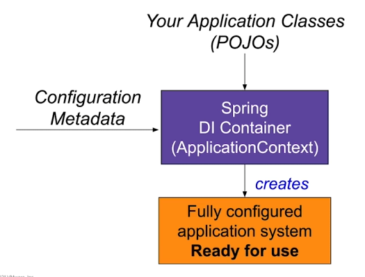
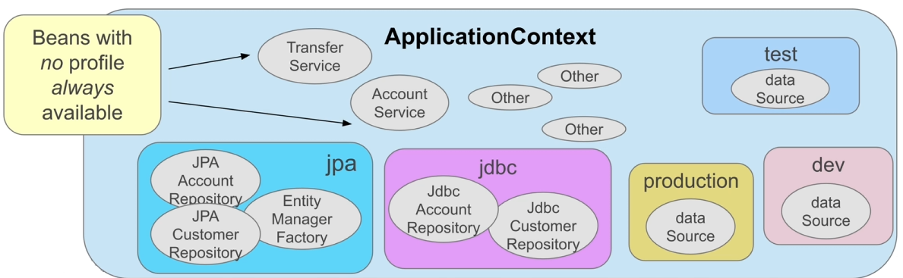
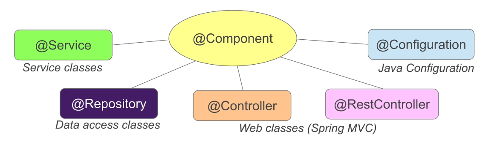
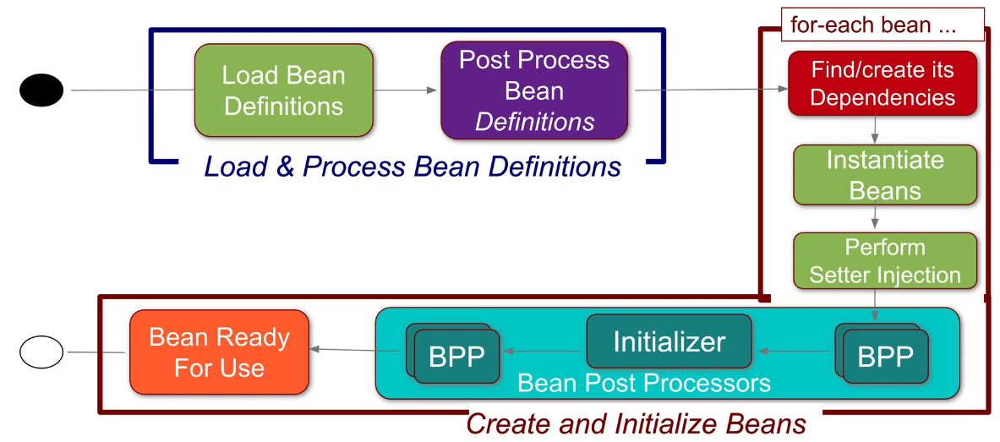
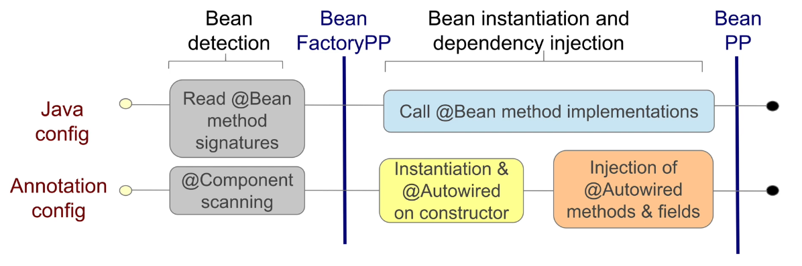
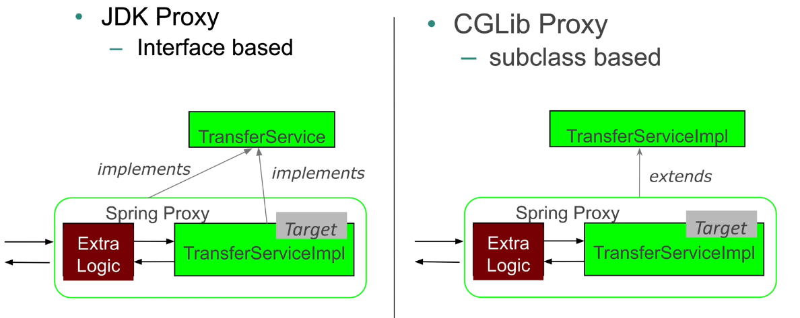

# Spring Core

*Last Updated : 05/2024 - Spring 6.2 - Spring Boot 3.4.*

### Summary

- [Spring](#spring)
- [Concepts](#concepts)
    - [Inversion of Control (IoC)](#inversion-of-control-ioc)
    - [Dependency Injection vs Inversion of Control](#dependency-injection-vs-inversion-of-control)
- [Application Context](#application-context)
- [Configuration](#configuration)
    - [Multiple configuration files](#multiple-configuration-files)
    - [Running the config](#running-the-config)
- [Class-based Configuration](#class-based-configuration)
    - [Dependencies - direct call](#dependencies---direct-call)
    - [Dependencies - reference](#dependencies---reference)
- [Annotation-based Configuration](#annotation-based-configuration)
    - [Component scanning](#component-scanning)
    - [Autowired](#autowired)
    - [Optional dependencies](#optional-dependencies)
    - [Qualifiers](#qualifiers)
    - [Delayed initialization](#delayed-initialization)
- [Class-based vs Annotation-based](#class-based-vs-annotation-based)
- [Bean Scope](#bean-scope)
    - [Singleton](#singleton)
- [External properties](#external-properties)
    - [Accessing properties](#accessing-properties)
- [Profiles](#profiles)
    - [Definition](#definition)
    - [Activation](#activation)
- [Stereotype Annotations](#stereotype-annotations)
- [Container Lifecycle](#container-lifecycle)
    - [Initialization](#initialization)
    - [Usage](#usage)
    - [Destruction](#destruction)
    - [Lifecycle Annotations](#lifecycle-annotations)

#
> Main sources : [Spring Academy Courses](https://spring.academy/home), [documentation](https://spring.io/projects/spring-framework).

<br>

## Spring

- Created in 2003.

- Framework to simplify the devlopment of Java EE Applications.

- **Open Source** (Apache 2 license).

- Owned by **VMware**.

- Lightweight.

- Provides tools and flexibility to create many kinds of architectures depending on application needs.

- Spring applications do not require a Java EE application server (but can run on one).

- Not *invasive* :
    - Does not require to extends framework classes or implement interfaces.
    - Write code as POJOs.

- Low overhead.

- Provide resources to work with lower-level technologies.

- Highly extensible & customizable.

- Provide choice at every level.

- Strong backward compatibility.

- Stong support from the community (forums, conferences, user groups...).

- Uses a **declarative approach** through ***annotations***.

- Wide use of annotations : everything happens at **runtime**.

<br>

Spring works around projects covering specific aspects of applications, that can be used altogether :

- **Inversion of Control (IoC)** and **Dependency Injection (DI)** Container to build components.
- Containerization, Cloud, Microservices.
- JDBC, Transactions, ORM / JPA, NoSQL.
- Events, Streaming, Reactive, Messaging, JMS, Tasks, Scheduling.
- Security, OAuth2, OpenID Connect.
- Monitoring.
- ...

<br>

## Concepts

- In a complex application, functionnalities may depend on one another.

- Each call to a dependency will require creating a new object, or having multiple implementations of the same functionnality.

*Ex :*

``` java
public class TransferService {

    private AccountRepository accountRepository;

    public TransferService() {
        this.accountRepository = new AccountRepository();
    }
}
```
- Each time the class `TransferService` is needed, a new instance has to be created.
- The class `AccountRepository` is also instantiated each time.
- `TransferService` depends on the implementation of `AccountRepository`.

<br>

**<u>Improvements</u>** :

- Instantiate dependencies outside the class and inject through constructor.

- Widespread use of **interfaces** :

    - The interface methods describe the **business logic**.
    - The implementation class encapsulates the **technical details**.

*Ex :*
 
``` java
public class TransferServiceImpl implements TransferService {
    public TransferServiceImpl(AccountRepository ar) {
        this.accountRepository = ar;
    }
}

public class JdbcAccountRepository implements AccountRepository {
    public AccountRepository(DataSource ds) {
        thid.dataSource = ds;
    }
}
```
**<u>Issues</u>** :

- `AccountRepository` and `DataSource` still need to be instantiated manually outside the interface, each time the dependency is needed.

- The data source is an external component part of the application context but still integrated within the business logic.

<br>

**<u>Improvements</u>** :

- **Dependency Injection**
    - Dependencies are instantiated once by the framework and injected as needed.

- **Inversion of Control**
    - External components are handled by the framework to wire everything up.

#
### Inversion of Control (IoC)

- Design pattern where custom parts of the program receive the **flow of control** from a generic framework.

- Objects define their dependencies *without creating them*.

- Delegates the job of constructing such dependencies to an **IoC container**.

- **Reusable code** and **problem-specific code** are developed *independently* even though they operate together in the application.

- **Callbacks**, **schedulers**, **event loops**, and the **template method** are examples of design patterns that follow the inversion of control principle.

- Mostly used in the context of object-oriented programming (OOP).

<br>

> [Related doc.](../java/designPatterns.md)

#
### Dependency Injection vs Inversion of Control

- **IoC** is about providing any kind of callback, which "implements" and/or controls reaction, instead of acting directly.

- **DI** is a specific version of the IoC pattern, where implementations are passed into an object through constructors/setters/service lookups, which the object will "depend" on in order to behave correctly.

<br>

## Application Context

- `org.springframework.context.ApplicationContext`.

- Represents the **Spring IoC Container**, which holds the Spring **Dependency Injection** mechanism.

- Sub-interface of `BeanFactory` (Interface providing an advanced configuration mechanism capable of managing any type of object).
    
- Provides :

    - Easier integration with Spring AOP features.
    - Message resource handling (for use in internationalization).
    - Event publication.
    - Application-layer specific contexts such as `WebApplicationContext` for use in web applications.

- Can be created anywhere (unit test, standalone app...).

- **Spring IoC** :

    - Instead of instantiating a new object each time, classes are defined as **beans** (components) through **configuration metadata**.
    - Beans are instantiated by the **Spring IoC container** and served whenever they are needed.
    - Therefore dependencies are only *defined*, then *injected* as needed.

- Configuraton can be : 

    - **class-based**

        - Explicitly defines beans using `@Beans` methods inside configuration classes.
    
    - **annotation-based**

        - Implicitly defines beans using `@Component` and component scanning.

    - **XML-based**

        - External centralized configuration; does not touch the source code.
        - Verbose.

<br>

> Annotation injection is performed before XML injection. Thus, the XML configuration overrides the annotations for properties wired through both approaches.

<br>



<br>

## Configuration

- Grouped in a root class, which is also a bean.

- Each config class *define* beans and may invoke other **subconfigs**.

- Annotated with `@Configuration`.

<br>

*Ex :*

``` java
@Configuration
public class ApplicationConfig {
    // ...
}
```
#
### Multiple configuration files

- Beans can be defined in specific config files to separate concerns.

<br>

*Ex :*

``` java
@Configuration
@Import(ApplicationConfig.class)
@Import(DataConfig.class)
public class ProdInfrastructureConfig {
    // ...
}
```
- `@Import` imports the config file as dependency.
- `ProdInfrastructureConfig` is the root bean of the application.

#
### Running the config

> `SpringApplication.run(<root_bean>)`

*Ex :*

**Main.java**

``` java
// Creates application context from the config.
ApplicationContext context = SpringApplication.run(ApplicationConfig.class);

// ---- Looks up a bean from the context ---- //

// 1 - ID only with cast.
TransferService s1 = (TransferService) context.getBean("transferService");

// 2 - ID and type.
TransferService s2 = context.getBean("transferService", TransferService.class);

// 3 - Bean is unique : no need for ID - recommended.
TransferService s3 = context.getBean(TransferService.class);

// Uses the bean.
s3.transfer(new Amount("300"), "1", "2");
```

- Here, `ApplicationConfig` is the root bean.
- The `transferService` bean can be referenced by multiple means, as shown in the examples.
- Beans are initialized in order of dependencies.

<br>

This method can be used for **unit tests** *without a framework* like **JUnit** :

``` java
public class TransferServiceTest {
    private TransferService service;

    @BeforeEach
    public void setUp() {
        ApplicationContext context = SpringApplication.run(ApplicationConfig.class);

        service = context.getBean(TransferService.class);
    }
    // ...
}
```
<br>

## Class-based Configuration

- Defines beans in a centralized dedicated Java class.

- **Beans** are defined explicitly, using the `@Bean` annotation.

- Beans with lowest dependencies are at the bottom.

- By default the name of the method is the name of the **bean**.

#
### Dependencies - direct call

*Ex :*

``` java
@Configuration
public class ApplicationConfig {
    @Bean
    public TransferService transferService() {
        return new TransferServiceImpl(accountRepository());
    }
    @Bean
    public AccountRepository accountRepository() {
		return new JdbcAccountRepository(dataSource());
	}
    @Bean
    public DataSource dataSource() {
        BasicDataSource dataSource = new BasicDataSource();
        dataSource.setDriverClassNamme("org.postgresql.Driver");
        dataSource.setUrl("jdbc:postgresql://localhost/transfer");
        dataSource.setUsername("transfer-app");
        dataSource.setPassword("1234");
        return dataSource;
    }
}
```
- The dependency bean is called directly : `TransferServiceImpl` invokes `accountRepository`.
#
### Dependencies - reference

*Ex :*

``` java
@Configuration
public class ApplicationConfig {
    @Bean
    public TransferService transferService(AccountRepository repository) {
        return new TransferServiceImpl(repository);
    }
    @Bean
    public AccountRepository accountRepository(DataSource dataSource) {
		return new JdbcAccountRepository(dataSource);
	}
    @Bean
    public DataSource dataSource() {
        BasicDataSource dataSource = new BasicDataSource();
        dataSource.setDriverClassNamme("org.postgresql.Driver");
        dataSource.setUrl("jdbc:postgresql://localhost/transfer");
        dataSource.setUsername("transfer-app");
        dataSource.setPassword("1234");
        return dataSource;
    }
}
```
<br>

## Annotation-based Configuration

- Beans are defined implicitly, using the `@Component` annotation.

- Bean definition is therefore *scattered* throughout classes.

- Bean id/name is derived from className.

- Requires `@ComponentScan` to tell where to find annotated classes.

<br>

*Ex :*

**TransferServiceImpl.java**

``` java
// Defines a bean.
@Component
public class TransferServiceImpl implements TransferService {
    // ...
}
```
**AppConfig.java**

``` java
@Configuration
// Tells the framework where to look to wire beans for this config.
@ComponentScan(basePackages="com.org.myconfig.classes") 
public class ApplicationConfig {
    // No bean definition needed anymore.
}
```
#
### Component scanning

- Components are scanned at **startup**.

- *JAR dependencies* are also scanned.

- **Slow startup time** if too many files scanned.

<br>

> **Good practice** : Provide detailed package paths to avoid scanning through many packages.

#
### Autowired

- `@Autowired`.

- Signals that **arguments** or **fields** are beans and must be injected through DI.

- Can be applied to :

    - **Constructors** (preferred).
    - **Methods**.
    - **Fields** (avoid).

<br>

*Ex :*

**Constructor injection** :

``` java
@Autowired // Optional if this is the only constructor.
public TransferServiceImpl(AccountRepository ar) {
    this.accountRepository = ar;
}
```
<br>

**Method (setter) injection** :

``` java
@Autowired
public void setAccountRepository(AccountRepository ar) {
    this.accountRepository = ar;
}
```
<br>

**Field injection** :

``` java
// To avoid - hard to test.
@Autowired
private AccountRepository acountRepository;
```
<br>

**<u>Differences</u>** :

| Contructor injection                   | Method injection                     |
|----------------------------------------|--------------------------------------|
| Mandatory dependencies.                | Circular dependencies possible.      |
| Dependencies can be immutable.         | Dependencies are mutable.            |
| Concise (pass several params at once). | Could be verbose for several params. |
|                                        | Inherited automatically.             |

<br>

**<u>Annotation scanning rule & omitting</u>** :

- Only 1 constructor :

    - Nothing to annotate.

- More than 1 constructor :

    - Invokes zero-arg constructor if exists.
    - Must annotate with `@Autowired` if another one has to be used.
    - If no zero-arg constructor and no annotation is present, an **error will be thrown**.

#
### Optional dependencies

- `required` attribute (`required=true` by default).

- Use of `Optional`.

<br>

*Ex :*

``` java
@Autowired // Throws exception if not found.
public void setAccountRepository(AccountRepository ar) {
    this.accountRepository = ar;
}
```
``` java
@Autowired(required=false)
public void setAccountRepository(AccountRepository ar) {
    this.accountRepository = ar;
}
```
<br>

``` java
// Using optionals.
@Autowired
public void setAccountService(Optional<AccountService> accountService) {
    this.accountService = accountService;
}

public void doSomething() {
    accountService.ifPresent(s -> {
        // ...
    });
}
```
#
### Qualifiers

- Autowiring is made by *type*.

- **Ambiguation** : If 2 or more components are of the same type, the framework will not know which one to inject and throw a `NoSuchBeanDefinitionException`.

- A bean **custom id** need to be specified and referenced using the `@Qualifier` annotation.

- This situation should be **avoided**, by changing implementation or using **profiles** to sort beans.

<br>

*Ex :*

``` java
@Component
public class TransferServiceImpl implements TransferService {
    public TransferServiceImpl(AccountRepository ar) {
        // ...
    }
}
```
``` java
@Component
public class JpaAccountRepository implements AccountRepository {
    // ...
}
```
``` java
@Component
public class JdbcAccountRepository implements AccountRepository {
    // ...
}
```
- Both `JpaAccountRepository` and `JdbcAccountRepository` are of type `AccountRepository` and annotated with `@Component`.

- The autowiring in `TransferServiceImpl` will throw an exception :

> `NoSuchBeanDefinitionException, no unique bean of type [AccountRepository] is defined: expected single bean but found 2...`

<br>

**<u>Solution</u>** :

``` java
@Component
public class TransferServiceImpl implements TransferService {
    public TransferServiceImpl(@Qualifier("jdbcAccountRepository") AccountRepository ar) {
        // ...
    }
}
```
``` java
@Component("jpaAccountRepository")
public class JpaAccountRepository implements AccountRepository {
    // ...
}
```
``` java
@Component("jdbcAccountRepository")
public class JdbcAccountRepository implements AccountRepository {
    // ...
}
```
#
### Delayed initialization

- `@Lazy`.

- Bean will be created :

    - When dependency is injected.
    - Through the `ApplicationContext.getBean` method.

- Useful if bean own dependencies are not available at startup.

<br>

*Ex :*

``` java
@Lazy
@Component
public class MailService {
    public MailService(@Value("smtp...") String url) {
        // Connects to mail server.
    }
}
```
- The **SMTP server** may not be running when this process starts up.

<br>

## Class-based vs Annotation-based

**Class-based** :

- Keeps beans decoupled from Spring.

- Keeps beans **centralized**.

- Only way to defines beans **outside of Spring** : external libraries, legacy code...

- Returns beans as **interfaces**.

<br>

**Annotation-based** :

- Shorter and more concise.

- Sometimes the only option available.

- **Stereotype annotations** available.

- Beans definition is **decentralized**.

- Returns **actual implementation class**.

<br>

*<u>Beans name and type definitions :</u>*

|                  | Name                                                                   | Type                     |
|------------------|------------------------------------------------------------------------|--------------------------|
| Class-based      | From method name by default or from `@Bean` name/value attribute.      | From method return type. |
| Annotation-based | Derived from class name by default or from annotation value attribute. | From annotated class.    |

<br>

## Bean Scope

Built-in bean **scopes** :

| Scope           | Scopes a single bean definition to...                              |
|-----------------|--------------------------------------------------------------------|
| **singleton**   | A single object instance for each Spring IoC container. (Default). |
| **prototype**   | Any number of object instances.                                    |
| **request**     | The lifecycle of a single HTTP request.                            |
| **session**     | The lifecycle of an HTTP Session.                                  |
| **application** | The lifecycle of a ServletContext.                                 |
| **websocket**   | The lifecycle of a WebSocket.                                      |

<br>

The last 4 scopes are only valid in the context of a **web-aware** application context.

#
### Singleton

- Default scope : does not need to be specified.
- Single instance cached in the container.
- Must be **thread-safe**.

- Handling multi-threading issues :

    - Use Stateless or Immutable beans.
    - Use `synchronized` (hard).
    - Use a different scope.

<br>

*Ex :*

``` java
@Bean
public AccountService accountService() {
    // ...
}
```
``` java
@Bean
@Scope("singleton") // Equivalent.
public AccountService accountService() {
    // ...
}
```
<br>

## External properties

- Removes dependencies to a **runtime configuration variable** inside compiled code.

- Derived from various sources :

    - JVM system properties : `System.getProperty()`.
    - Environment variables : `System.getenv()`.
    - Java custom properties files.

- The `Environment` bean is populated by default with JVM system properties & environment variables.

- Additional properties files (ex : datasources configurations) need to be declared manually.

- Available resource prefixes :

    - `classpath`.
    - `file`.
    - `http`.

<br>

*Ex :*

``` java
@PropertySource("classpath:/com/org/config/app.properties")
@PropertySource("file:config/local.properties")
```
#
### Accessing properties

*Ex :*

**app.properties**

``` properties
db.driver=org.postgresql.Driver
db.url=jdbc:postgresql://localhost/transfer
db.user=transfer-app
db.password=1234
```
<br>

- `Environment` bean :

``` java
// Class config.
@Configuration
public class DbConfig {
    @Bean
    public DataSource dataSource(Environment env) {
        BasicDataSource ds = new BasicDataSource();

        ds.setDriverClassNamme(env.getProperty("db.driver"));
        ds.setUrl(env.getProperty("db.url"));
        ds.setUsername(env.getProperty("db.user"));
        ds.setPassword(env.getProperty("db.password"));

        return ds;
    }
}
```
<br>

- **Spring Expression Language (SpEL)** :

``` java
// Class config.
@Configuration
public class DbConfig {
    @Bean
    public DataSource dataSource(
        @Value("${db.driver}") String driver,
        @Value("${db.url}") String url,
        @Value("${db.user}") String user,
        @Value("${db.password}") String pwd
    ) {
        BasicDataSource ds = new BasicDataSource();
        ds.setDriverClassNamme(driver);
        ds.setUrl(url);
        ds.setUsername(user);
        ds.setPassword(pwd);
        return ds;
    }
}
```
``` java
// Constructor injection.
@Autowired
public TransferServiceImpl(@Value("${daily.limit}") int max) {
    this.maxTransfersPerDay = max;
}
```
``` java
// Method injection.
@Autowired
public void setDailyLimit(@Value("${daily.limit}") int max) {
    this.maxTransfersPerDay = max;
}
```
``` java
// Field injection.
@Value("#{environment['daily.limit']}")
int maxTransfersPerDay;
```
<br>

## Profiles

- Beans can be grouped into **profiles**.

- Profiles can be :

    - **Environments** : "dev", "test", "production".
    - **Implementation** : "jdbc", "jpa".
    - **Platform** : "on-premise", "cloud".

- Beans are included / excluded based on profile membership.

<br>



<br>

#
### Definition

- At the **config level** - all beans are included.

``` java
@Configuration
@Profile("embedded")
@PropertySource("embedded.properties")
public class DevConfig {

    @Bean
    public DataSource dataSource() {
        EmbeddedDatabaseBuilder builder = new EmbeddedDatabaseBuilder();
        // ...
    }
}
```
<br>

- At the **bean level**.

``` java
// Class config.
@Configuration
public class DevConfig {

    @Bean(name="dataSource")
    @Profile("embedded")
    public DataSource dataSourceForDev() {
        EmbeddedDatabaseBuilder builder = new EmbeddedDatabaseBuilder();
        // ...
    }

    @Bean(name="dataSource")
    @Profile("!embedded")
    public DataSource dataSourceForProd() {
        BasicDataSource dataSource = new BasicDataSource();
        // ...
    }
}
```
``` java
// Annotation config.
@Component
@Profile("embedded")
public class TransferServiceImpl implements TransferService {
    
    @Autowired
    public TransferServiceImpl(AccountRepository ar) {
        // ...
    }
}
```
#
### Activation

- System property via command line :

> `-Dspring.profiles.active=<profile_1>, <profile_2>`

- System property programmatically, before running :

``` java
System.setProperty("spring.profiles.active", "embedded, jpa");
SpringApplication.run(AppConfig.class);
```
- In integration tests using `@ActiveProfiles`.

<br>

## Stereotype Annotations

- Component scanning also checks for annotations that are themselves annotated with `@Component`.

*Ex :*

``` java
// Some bean.
@ComponentScan("transferService")
// ...
```
``` java
@Service("transferService")
public class TransferServiceImpl implements TransferService {
    // ...
}
```
``` java
// Service annotation class.
@Target({ElementType.TYPE})
@Component
public @interface Service {
    // ...
}
```
`@Service` is annotated with `@Component`, so component scanning will recognize the annotation.

<br>

- Spring framework stereotype annotations :



<br>

Other Spring projects have their own stereotype annotations.

<br>

`@Configuration`

- Defines a bean configuration class.
- Can contain bean definition methods annotated with `@Bean`.

<br>

`@Controller`

- Signals the framework that this class serves as a *controller* in **Spring MVC**.

<br>

`@Service`

- Singals that the class contains **business logic** common to the service layer.

<br>

`@Repository`

- Part of the **database access layer** of the application.
- Enables automatic **persistence exception translation** :
    - Native exceptions thrown within annotated classes will be automatically translated into subclasses of Spring `DataAccessExeption`.

<br>

All these annotations are ***meta-annotations*** of `@Component`.

<br>

## Container Lifecycle

### Initialization



<br>

- Start point : `SpringApplication.run`.

<br>

**<u>Processing</u>** :

- Loads and centralizes bean definitions from **all config sources** :

    - Processes configuration classes.
    - **Component scanning**.

- Bean definitions are added to the `BeanFactory` (`ApplicationContext` is a subinterface of `BeanFactory`).

- Beans are indexed under their **id** and type.

- Special `BeanFactoryPostProcessor` beans invoked, which can modify definitions.

<br>

**<u>Creation</u>** :

- Each singleton bean **eagerly instantiated**, unless lazy.

- Dependencies are resolved **recursively**.

- Can use `@DependsOn("<bean_id>")` to explicitly declare dependencies and **force order**.

- Bean **post processors** can modify bean behavior.

<br>



<br>

**Bean factory post processor** :

- Extension point.

- `static` `@Bean` that will run before any bean is created.

- Custom post processors can be implemented.

- Common example of post processor : 

    - `@Value` resolvers.
    - Checks if any bean is created from a **deprecated** class.

**Bean post processor** :

- Will run **against every bean**.

- Before init and after init methods available.

- Calls **initializers** : enable external annotations (`@PostConstruct`)...

- Typical usage : **around** advices (proxies).

- Custom post processors can be implemented.

#
### Usage

- Start point : `ApplicationContext.getBean` :

    - Retrieves the **bean object**, or a **proxy** (**TransactionManager**...).

- Proxies are created during init by the post processor.

<br>

| JDK Proxy                     | CGLib Proxy                                   |
|-------------------------------|-----------------------------------------------|
| Also called dynamic proxies   | NOT built into JDK                            |
| API built into the JDK        | Included in Spring Jars                       |
| Interface based               | Class based                                   |
| All interfaces proxied        | Cannot be applied to final classes or methods |

<br>



<br>

#
### Destruction

- Start point : `ApplicationContext.close` :

    - Executes all `@PreDestroy` and `destroyMethod` methods.

    - Releases all beans for **Garbage Collection**.

    - Beans are also cleaned when going **out of scope** (session close...). Only exception is for prototype beans : we don't know when they're going to be destroyed.

    - Only appends in case of a **graceful shutdown**.

#
### Lifecycle Annotations

- Encapsulated inside `ConfigurableApplicationContext`, a subinterface of `ApplicationContext`.

- `@PostConstruct`

    - Called at startup after all dependencies have been injected.
    
- `@PreDestroy`

    - Releases resources & cleans up.
    - Only called after a normal shutdown.
    - Called :
        - At shutdown prior to destroying the bean instance.
        - When a `ConfigurableApplicationContext` is closed.

- Annotated methods can have any visibility but must take **no arguments** and only return **void**.

- Not Spring-exclusive annotations : 

    - `javax.annotation` package.
    - Supported since Java 6.

- Attributes for external classes :

    - `initMethod`.
    - `destroyMethod`.

<br>

*Ex :*

``` java
public class JdbcAccountRepository {

    private DataSource dataSource;

    @Autowired
    public void setDataSource(DataSource dataSource) {
        this.dataSource = dataSource;
    }

    @PostConstruct
    void populateCache() {
        Connection con = dataSource.getConnection();
        // ...
    }

    @PreDestroy
    void flushCache() {
        // ...
    }
}
```
``` java
ConfigurableApplicationContext context = SpringApplication.run(...);

// ...

// Triggers call of all @PreDestroy annotated methods.
context.close();
```
<br>

Attributes for class-defined beans :

``` java
@Bean(initMethod="populateCache", destroyMethod="flushCache")
public AccountRepository accountRepository() {...}
```
<br>