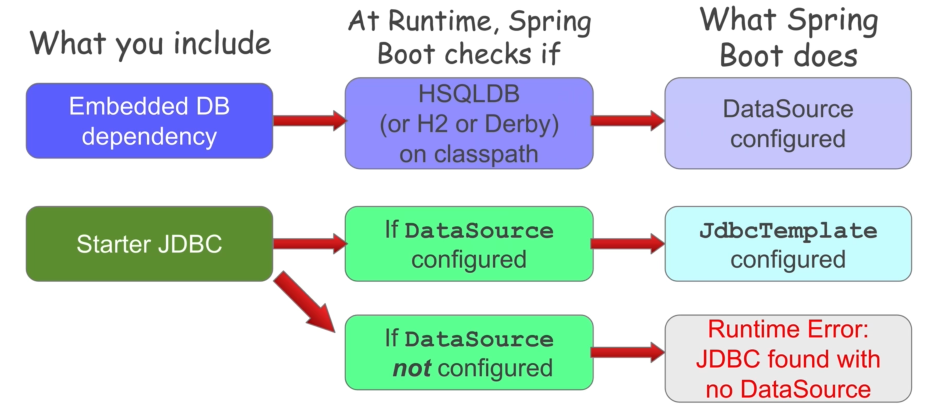
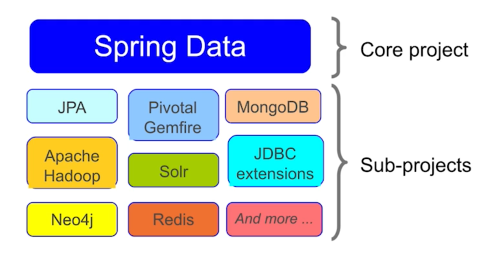
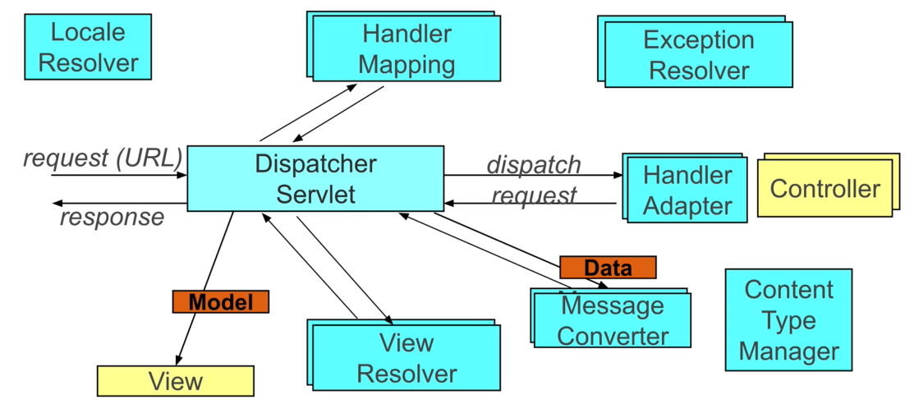
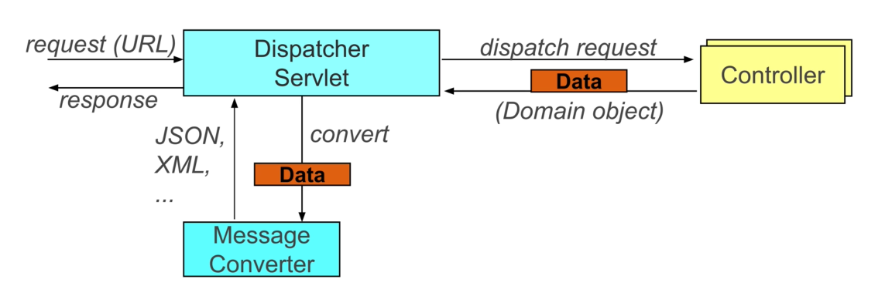

# Spring Boot

*Last Updated : 05/2024 - Spring 6.2 - Spring Boot 3.4.*

### Summary

- [Overview](#overview)
    - [Initializr](#initializr)
    - [Misc](#misc)
- [Dependencies](#dependencies)
- [Auto Configuration](#auto-configuration)
    - [Conditional configuration](#conditional-configuration)
    - [Autoconfig classes](#autoconfig-classes)
    - [Overriding autoconfig](#overriding-autoconfig)
- [Properties](#properties)
    - [Load order](#load-order)
    - [Yaml support](#yaml-support)
    - [Single-file profiles](#single-file-profiles)
    - [Configuration properties](#configuration-properties)
- [Packaging](#packaging)
    - [JAR vs WAR](#jar-vs-war)
- [Runners](#runners)
- [Spring Data](#spring-data)
- [Spring Data JPA](#spring-data-jpa)
    - [Data Initialization strategies](#data-initialization-strategies)
    - [Repositories](#repositories)
    - [JPA vs Spring Data JPA](#jpa-vs-spring-data-jpa)
- [RESTful Applications](#restful-applications)
    - [REST](#rest)
    - [REST and Java](#rest-and-java)
    - [RestTemplate vs WebClient](#resttemplate-vs-webclient)
- [Spring MVC](#spring-mvc)
    - [Servlet](#servlet)
    - [Controller](#controller)
    - [Message converter](#message-converter)

#
> Main sources : [Spring Academy Courses](https://spring.academy/home), [documentation](https://spring.io/projects/spring-framework).

<br>

## Overview

- Some components are recurents in applications and infrastructures :

    - **Data sources**.
    - **Transaction managers**.
    - ...

- Spring Boot provides **out of the box configurations** and **non-functional features** for low-level, predictable infrastructure :

    - Embedded servers.
    - Metrics.
    - Health checks.
    - Containerization.
    - ...

- **Opinionated** : choices in config have been made (can be **overriden** as per Spring philosophy).

- Faster and accessible getting-started platform for project developpments.

- Builds FAT JARs for easy deployment.

- Simplifies dependency management.

- **Not** :

    - A code generator.
    - An IDE plugin.

#
### Initializr

- API to generate initial Spring Boot application projects.

- Contructs starting **templates** for Spring Boot projects.

    - Folder structure.
    - Maven / Gradle build files with specified starter dependencies.

- Accessible as a "new project" wizard in STS, IntelliJ Ultimate.

- Can fork source code to create a custom initializr with custom dependencies options.

#
### Misc

- ASCII banner can be customized using a `banner.txt` file under resources.

- Spring autoloads sql scripts under resources by default.

- Can be overriden :

> - `spring.sql.init.schema-locations=<sql_schema_file_path>`
> - `spring.sql.init.data-locations=<sql_data_file_path>`

- Spring Boot creates a **pooled data source** by default : **HikariCP**.

- Can be overriden : `spring.datasource.type`.

<br>

## Dependencies

- Makes it easier to manage compatible dependencies (Spring JARs, 3rd party JARs...) though starters options and **maven** / **gradle** config.

- Bundles of dependencies with versions working together.

- Manually managing dependencies is still possible.

- Many starter bundles available :

    - `spring-boot-starter-web`.
    - `spring-boot-starter-jdbc`.
    - `spring-boot-starter-data-jpa`.
    - `spring-boot-starter-batch`.

*Ex :*

- `spring-boot-starter` resolves :

    - `spring-boot-*.jar`.
    - `spring-core-*.jar`.
    - `spring-context-*.jar`.
    - `spring-aop-*.jar`.
    - ...

- `spring-boot-starter-test` resolves :

    - `spring-test-*.jar`.
    - `junit-*.jar`.
    - `mockito-*.jar`.
    - ...

<br>

## Auto Configuration

- `@EnableAutoConfiguration` on a configuration class.

- Automatically creates **beans** Spring think are needed based on some conditions.

- Can use `@SpringBootApplication` that combines :

    - `@SpringBootConfiguration`.
    - `@ComponentScan`.
    - `@EnableAutoConfiguration`.

- Managed by a set of **autoconfig classes** which uses conditional annotations based on conditions :

    - Classpath includes specific classes ?
    - Some properties set ?
    - Specific beans already configured ?

<br>

*Ex :*

``` java
// @SpringBootConfiguration // Extends @Configuration.
// @ComponentScan("example.config")
// @EnableAutoConfiguration
@SpringBootApplication(scanBasePackages="example.config")
public class Application {
    public static void main(String[] args) {
        SpringApplication.run(Application.class);
    }
}
```
<br>

Example of autoconfiguration visual :



<br>

#
### Conditional configuration

- Use of `@Conditional*` annotations from Spring 4.0 onwards :

    - `@ConditionalOnBean`
    - `@ConditionalOnMissingBean`
    - `@ConditionalOnClass`
    - `@ConditionalOnMissingClass`
    - `@ConditionalOnProperty`
    - ...

- `@Profile` is an example of conditional configuration.

<br>

*Ex :*

``` java
// Creates JdbcTemplate only when a DataSource bean already exists.
@Bean
@ConditionalOnBean(DataSource.class)
public JdbcTemplate jdbcTemplate(DataSource dataSource) {
    // ...
}
```
#
### Autoconfig classes

- Defined with `@AutoConfiguration`.

- `org.springframework.boot.autoconfigure` package.

- Spring Boot defines a number of autoconfig classes that activate in response to dependencies on the classpath and configure beans if not already configured.

- Custom autoconfig can be created, to use with custom starter dependencies.

<br>

*Ex :*

``` java
@AutoConfiguration
// ...
public class DataSourceAutoConfiguration {
    // ...
    @ConditionalOnMissingBean(DataSource.class)
    @Import({EmbeddedDataSourceConfiguration.class})
    protected static class EmbeddedDatabaseConfiguration {
        // ...
    }
}
```
#
### Overriding autoconfig

- Set some of Spring Boot properties.

    - Spring will autoconfigure default beans based on specified properties.

*Ex :*

``` properties
spring.datasource.url=jdbc:mysql://localhost:test
spring.datasource.username=test
spring.datasource.password=dbpass
spring.datasource.driver-class-name=com.mysql.jdbc.Driver
```
<br>

- Explicit bean definition (autoconfig based on bean **type**, not name).

- Explicitly disable some auto-configuration : 

>    - `@SpringBootApplication(exclude=<classname>.class)`.
>    - `@EnableAutoConfiguration(exclude=<classname>.class)`.
>    - Property `spring.autoconfigure.exclude=<full_class_path>`.

- Change dependencies or versions.

*Ex :*

**pom.xml**

``` xml
<dependency>
    <groupId>org.springframework.boot</groupId>
    <artifactId>spring-boot-starter-web</artifactId>
    <exclusions>
        <!-->Do not import tomcat from default bundle.<-->
        <exclusion>
            <groupId>org.springframework.boot</groupId>
            <artifactId>spring-boot-starter-tomcat</artifactId>
        </exclusion>
    </exclusions>
</dependency>
<dependency>
    <groupId>org.springframework.boot</groupId>
    <artifactId>spring-boot-starter-jetty</artifactId>
</dependency>
```
<br>

## Properties

- Spring Boot uses a `application.properties` files :

    - Root `application.properties` (always loaded).
    - `application-<profile>.properties` containing profile-specific properties.

- Other properties definition methods **still available**.

- `application.properties` gets loaded **before all the other properties files** in `@PropertySource`.

    - Some properties can only be set in `application.properties`, such as logging, which boots early on.

- Looks for `application.properties` in default locations (in order) :

    - `/config` sub-directory of the working directory.
    - Working directory.
    - `config` package in classpath.
    - classpath root.

- Creates property sources based on `application*.properties` files.

#
### Load order

- Spring Boot loads properties in the following order (first has precedence over all others) :

    - Devtools settings.
    - `@TestPropertySource` and `@SpringBootTest` properties.
    - Command line arguments.
    - inline JSON properties : `SPRING_APPLICATION_JSON`.
    - `ServletConfig` / `ServletContext` parameters.
    - JNDI attributes from java:comp/env.
    - Java System properties.
    - OS environment variables.
    - Profile-specific application properties.
    - `application.properties` / `application.yml`.
    - `@PropertySource` files.
    - `SpringApplication.setDefaultProperties`.

#
### Yaml support

- Spring Boot specifics.

- Supports **yaml configs** (`application.yml`) with **2 spaces indent**.

- Requires `snakeyaml` from `spring-boot-starter` dependency.

- Avoids repeating prefixes through **indentation**.

<br>

*Ex :*

**application.properties**

``` properties
rewards.client.host=192.168.1.42
rewards.client.port=80
rewards.client.logdir=/logs
rewards.client.timeout=2000
```
**application.yml**

``` yaml
rewards: 
  client:
    host: 192.168.1.42
    port: 80
    logdir: /logs
    timeout: 2000
```
#
### Single-file profiles

- Multiple profile specific properties can be placed inside a **single file**.

- Groups of properties are separated with `---`.

- Works for both *properties* and *yaml* files.

<br>

*Ex :*

**application.yml**

``` yaml
spring.datasource: # always loaded
  driver: org.postgresql.driver
  username: user
---
spring:
  profiles: local
  datasource:
    url: jdbc:postgresql://localhost/xfer
    password: admin
---
spring:
  profiles: cloud
  datasource:
    url: jdbc:postgresql://prod/xfer
    password: aaa
```
- Properties will be selected according to the active profile.

#
### Configuration properties

- Referencing individual external properties for **large sets** can be cumbersome.

*Ex :*

``` java
@Configuration
public class RewardsClientConfiguration {
    @Value("${rewards.client.host}") String host;
    @Value("${rewards.client.port}") int port;
    @Value("${rewards.client.logdir}") String logdir;
    @Value("${rewards.client.timeout}") int timeout;
    // ...
}
```
<br>

- Dedicated classes can be created to hold external properties :

    - `@ConfigurationProperties` on a dedicated bean.
    - Avoids repeating prefixes.
    - Can be scanned through :

        - `@EnableConfigurationProperties(<class_name.class>)`
        in the application class.
        - Add `@ConfigurationPropertiesScan` in the application class (auto scans for `@Component` properties classes).
        - `@Component` on the class.


*Ex :*

**application.properties**

``` properties
rewards.client.host=192.168.1.42
rewards.client.port=80
rewards.client.logdir=/logs
rewards.client.timeout=2000
```
**ConnectionSettings.java**

``` java
@Component
@ConfigurationProperties(prefix="rewards.client")
public class ConnectionSettings {

    private String host;
    private int port;
    private String logdir;
    private int timeout;
    
    // getters / setters.
}
```
**RewardsApplication.java**

``` java
@SpringBootApplication
// Scans for @Component annotated properties classes.
@ConfigurationPropertiesScan
public class RewardsApplication {
    // ...
}
```
<br>

- Uses **relaxed binding**.

*Ex :*

``` java
@ConfigurationProperties(prefix="rewards.client-connection")
public class ConnectionSettings {
    private String hostUrl;
    // ...
}
```
Valid matches :

- `rewards.clientConnection.hostUrl`
- `revards.client-connection.host-url`
- `revards.client_connection.host_url`
- `REWARDS_CLIENTCONNECTION_HOSTURL`

<br>

## Packaging

- Normal JAR files contains only the compiled classes of the package, and nothing else.

- Spring Boot can create **FAT JARs** (or **UBER JARs**) :

    - Contains all **dependencies** plus extras like web servers (*Tomcat*) for web applications.
    - Simple endpoint with everything **bundled**.
    - Considerably **heavier** than normal JARs.
    - Can be run directly with the `-jar` command.
    - Can be created with Spring Boot plugin during packaging task.

- Use of **Spring Boot plugin** :

    - `spring-boot-maven-plugin`.
    - Creates a FAT JAR **along with** the original JAR containing only the compiled classes.
    - Adds a task `spring-boot:run` to run the application from the fat JAR.

#
### JAR vs WAR

- Spring Boot can run both strategies.

- JAR (FAT JAR) :

    - Self-contained application.
    - Heavy.

- Running within a Web Container :

``` java
@SpringBootApplication
public class Application extends SpringBootServletInitializer {

    protected SpringApplicationBuilder configure(SpringApplicationBuilder application) {
        return application.sources(Application.class); // Web container support.
    }
}
```
<br>

## Runners

- Spring-style entry point for running applications.

- Executes logic after creating context.

- Eliminates the need for logic inside the `main` method.

- `CommandLineRunner` :

    - `run` method, args as array.

- `ApplicationRunner` :

    - `run` method, args as `ApplicationArguments` : more sophisticated.

<br>

*Ex :*

``` java
@SpringBootApplication
public class Application {

    public static void main(String[] args) {
        SpringApplication.run(Application.class, args);
    }

    // Fills args with a query result and runs the query.
    @Bean
    CommandLineRunner commandLineRunner(JdbcTemplate jdbcTemplate) {
        String query = "SELECT count(*) FROM ACCOUNT";

        return args -> System.out.println(
            jdbcTemplate.queryForObject(query, Long.class));
    }
}
```
<br>

## Spring Data
 
- Core project that support many subprojects.

- Provides support for NoSQL, Column databases in the same way Spring does for RDBMS databases :

    - Template classes to hide boilerplate.
    - Common data access exceptions.
    - Portability over different storage technologies.
    - Implements **repositories**.

<br>



<br>

## Spring Data JPA

- `spring-boot-starter-data-jpa`.

- JPA default provider : **Hibernate**.

- Resolves :

    - `spring-boot-starter.jar`.
    - `spring-boot-starter-jdbc.jar`.
    - `spring-boot-starter-aop.jar`.
    - `spring-data-jpa.jar`.
    - `hibernate-core`.
    - `javax.transaction-api`.
    - ...

- Auto-configures :

    - `DataSource`.
    - `EntityManagerFactoryBean` (customizeable).
    - `JpaTransactionManager` (customizeable).

- Database will be populated with data from specified entities automatically by **DDL** (tables, relations...).

- Entities are scanned in the same package as the `@EnableAutoConfiguration` class.

- Can specify package with `@EntityScan`.

- Can specify vendor-provider properties :

    - `spring.jpa.properties.hibernate.xxx`.

- Customize JPA solely using **spring properties**.

#
### Data Initialization strategies

- Embedded databases can be initialized using the data from defined entities to generate the **database schema**, using `EntityManagerFactory` beans.

- `spring.jpa.hibernate.ddl-auto` will control the Hibernate initialization strategy :

    - `create-drop` : wipes existing data and populate anew at each startup.
    - `none` : **prevents auto-initialization**.

- A schema script can be specified using `spring.sql.init.schema-locations`.

- The database can be populated with data after creation using scripts at `spring.sql.init.data-locations`.

- By default, SQL database initialization is only performed when using an embedded in-memory database.

    - Can always be performed or disabled using `spring.sql.init.mode`.

<br>

**Initialization through DDL and from script should not be used together**.

- If **DDL is used**, data population of tables using a `data.sql` must wait after the schema has been generated , by setting `spring.jpa.defer-datasource-initialization=true`.

#
### Repositories

- Implementation created at runtime with proxies, as bean.

- Custom implementations can be added.

- Scans for interfaces extending Spring Data Common `Repository<T, K>` where T is the type and K is the type of the primary key :

    - Scanned in config package by default.
    - Can specify package with `@EnableJpaRepositories(basePackages="<path>")`.

- Can auto-generate CRUD methods.

- Supports paging, sorting, custom queries via specifics subinterfaces.

- Steps :

    - Annotate domain class, define keys, enable persistence.

        ``` java
        @Entity
        // @Table(...)
        public class Customer {

            @Id
            @GeneratedValue(strategy=GenerationType.AUTO)
            private Long id;

            private Date orderDate;
            private String email;
            // ...
        }
        ```
        - Columns names are the entity's params names by default.
        - An id has to be specified.
        - Table name is mapped to class name by default. Can be specified if different.
        - Other annotations available for other data stores :

            - `@Document` - MongoDB.
            - `@NodeEntity` - Neo4J.
            - `@Region` - Gemfire.
            - ...

    <br>

    - Define the repository as an *interface* extending the repositories interfaces (usually `JpaRepository<T, K>`).

    <br>

- Can implement finders :

    - With template `find(First)by<DataMemberOfClass><Operator><Chain>`, the operator being `GreaterThan`, `NotEquals`, etc.

    - With `@Query(<sql>)` to specify a custom name.

- Custom queries use the language of underlying product.

#
### JPA vs Spring Data JPA

- Traditional JPA will use an `EntityManager` to perform queries from JDBC.

- Spring Data JPA hides the entity manager implementation and declaration (`EntityManagerFactoryBean`) in `Repository` interfaces.

- Simply extend `JpaRepository<T, K>` to benefit from all common queries methods (`findAll`, `findById`...).

<br>

## RESTful Applications

### REST

- Architectural style describing best practices to *expose* web services over HTTP.

- Exposes resources through **URIs**.

- Supports well defined set of operations and results :

    - **GET, POST, PUT, PATCH, DELETE, HEAD, OPTIONS, TRACE**.
    - Headers.
    - Status codes.

- Resources support multiple representations (*json, xml...*).

- Representations can link to other resources, allowing for extensions & discovery :

    - **Hypermedia As The Engine Of Application State (HATEOAS)**.

- **Stateless architecture** :

    - Scalable for mobile applications or microservices.
    - Loose-coupling between client and server.

#
### REST and Java

- Jakarta RESTful Web Services (**JAX-RS**) from Jakarta EE.

- Jersey, RESTEasy, Apache CXF.

- **Spring MVC** provides REST support through `RestTemplate` or `WebClient`.

#
### RestTemplate vs WebClient

- HttpClients that can process and perform requests.

- Can be used for testing or for connecting to other APIs.

<br>

**RestTemplate** :

- Blocking synchronous client.
- Not supported anymore (but not deprecated).

**WebClient** :

- Non-blocking reactive client.
- Flexible : can support blocking requests, streaming...

<br>

## Spring MVC

- Based on the [MVC pattern](../java/design-patterns.md).

- POJO programming with independent business logic controller units.

- Spring for configuration.

- Server-side web rendering or REST.

Types of Spring MVC applications :

- Web servlet.
- Web reactive.

#
### Servlet

- Types of strategy :

    - Embedded servlet containers :

        - FAT JAR, embedded server.
        - Run app from command line.

    - WAR packaging.

<br>

Embedded servlet containers :

- `spring-boot-starter-web`.

- Resolves :

    - `spring-web.jar`.
    - `spring-webmvc.jar`.
    - `spring-boot-starter.jar`.
    - `jackson*.jar`.
    - `tomcat-embed*.jar`.
    - ...

- Sets up :

    - `DispatcherServlet`.
    - Internal config to support controllers.
    - Default resource locations (images, CSS, Javascript).
    - Default message converters.
    - An embedded Tomcat server.
    - ...

Server-side rendering structure :



- Only views and controllers need to be implemented with business logic to treat incoming messages.

- A RESTful application (client-side rendering) will simply not implement the views and instead return the transformed data from the controller back to the client via the communication network, without processing, injecting and rendering the view.

#
### Controller

- Request processing lifecycle :



<br>

- `@Controller`.

- Component containing methods to handle incoming HTTP requests, according to their type (GET, POST...) :

- `@RequestMapping` defines a request.

    ``` java
    @RequestMapping(path="store/orders", method=RequestMethod.GET)
    // Analog to @GetMapping("store/orders").
    ```
    - Can use shortcut anontations :

        - `@GetMapping`, `@PostMapping`, `@PutMapping`, `@PatchMapping`, `@DeleteMapping`.
        - `@RequestMethod` for **HEAD**, **OPTION**, **TRACE**.

    - Incoming and outcoming bodies are automatically converted in and from Java Objects to the specified output by the message converter.

- `@ResponseBody` defines a REST response.

    - Turns off the view handling subsystem.

- `@RestController` combines :

    - `@Controller`.
    - `@ResponseBody` for each method.

- Method arguments :

    - Servlet parameters : HttpServletRequest, HttpSession, Principal, Locale...
    - `@RequestParam("<param>") T param`.
    - `@PathVariable`.
    - `@RequestBody`.
    - ...

> Request parameters (body, headers, cookies...) should be accessed using their corresponding annotations instead of the request object directly.

- Response can be manually customized using `ResponseEntity`.

*Ex :*

``` java
ResponseEntity<Order> response =
    ResponseEntity.ok()
        .contentType(MediaType.TEXT_PLAIN) // Defines custom headers.
        .lastModified(order.lastUpdated()) // Defines custom headers.
        .body(order);
```
<br>

- `@ResponseStatus` can specify a default status for the method.

- Building response URIs :

    - `UriComponentBuilder` :

        - Allows explicit declaration of URIs.
        - Requires hard-coded URLs.

    - `ServletUriComponentBuilder` :

        - Subclass of `UriComponentBuilder`.
        - Provides access to the original URL.

*Ex :*

``` java
URI location = ServletUriComponentBuilder
    .fromCurrentRequestUri() // Framework puts URL in current thread.
    .path("/{itemId}")
    .buildAndExpand("item A") // URI encoding.
    .toUri();

return ResponseEntity.created(location).build();

// http://server/store/orders/12/items/item%20A
```
#
### Message converter

- `HttpMessageConverter`.

- Automatically maps Objects to response format (JSON, xml, image...).

- Response format from the `Accept` request header.

*Ex :*

`Accept: application/json` will format the response to `Content-Type : application/json`.