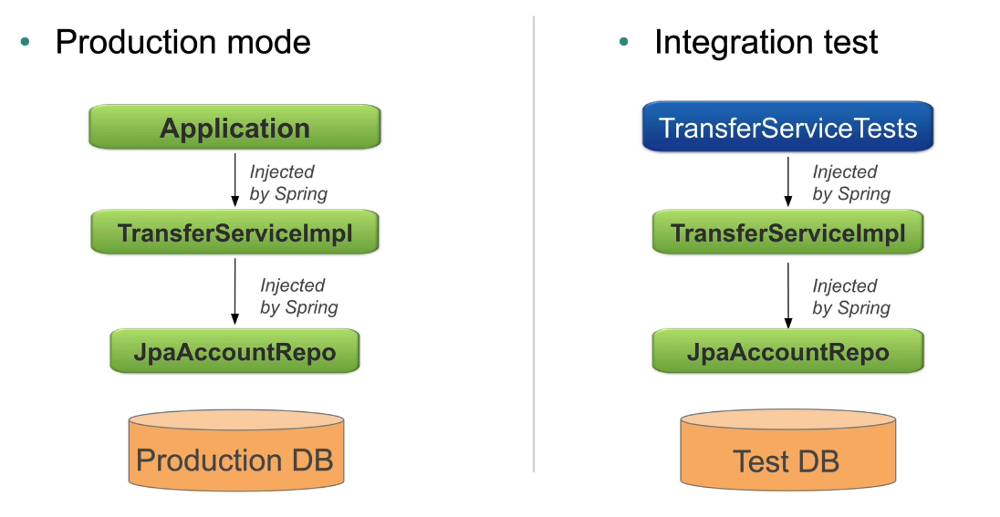

# Testing

*Last Updated : 05/2024 - Spring 6.2 - Spring Boot 3.4.*

### Summary

- [Unit Testing](#unit-testing)
- [JUnit](#junit)
- [Integration Testing](#integration-testing)
    - [Spring](#spring)
    - [Spring Boot specifics](#spring-boot-specifics)
    - [Common annotations](#common-annotations)
    - [Property sources](#property-sources)
    - [Profiles](#profiles)
- [Databases](#databases)
    - [Embedded databases](#embedded-databases)
    - [Basic syntax](#basic-syntax)
    - [Execution Phase](#execution-phase)
    - [Config](#config)

#
> Main sources : [Spring Academy Courses](https://spring.academy/home), [documentation](https://spring.io/projects/spring-framework).

<br>

## Unit Testing

- Tests 1 core unit of **functionality**.

- Keeps dependencies **minimal**.

- **Isolated** from environment (including Spring).

- Fakes dependencies using **mocks** and **stubs**.

- Typically used for **business logic** or **method behavior** : evaluates the returned value against an *expected output*.

- Usually use a framework : **JUnit 5** for Java.

<br>

*Ex :*

``` java
public class TransferServiceTest {
    private TransferService service;

    @BeforeEach
    public void setUp() {
        ApplicationContext context = SpringApplication.run(ApplicationConfig.class);

        service = context.getBean(TransferService.class);
    }
    
    @Test
    public void ServiceTest() {
        // Tests the service independently.
    }
}
```
- Manually wires an application context before each test method to retrieve beans.

#
### JUnit

- **Spring 5.3** supports **JUnit 5** by default.

- Provides **annotations** to simplify testing.

<br>

**JUnit 4 vs JUnit 5**

| Junit 4        | JUnit 5       |
|----------------|---------------|
| `@Before`      | `@BeforeEach` |
| `@BeforeClass` | `@BeforeAll`  |
| `@After`       | `@AfterEach`  |
| `@AfterClass`  | `@AfterAll`   |
| `@Ignore`      | `@Disabled`   |

<br>

- Careful when importing annotations. **JUnit 5** annotations are in the **Jupiter** api (even the basic `@Test`).

- JUnit 5 introduces new annotations : `@DisplayName`, `@Nested`, `@ParametrizedTest`...

<br>

## Integration Testing

- Tests the interactions of multiple units working together (*all should work individually first*).

- Tests application classes in context of their **surrounding infrastructure**, including the **framework**.

- Typically used to test :

    - **CRUD** behavior.
    - Data **exchange**.
    - **Auth** processes.

- Tests by scaling down the infrastructure layer :

    - Small, throwaway instances of databases, messaging systems...
    - **Embedded** databases.
    - Docker containers.

<br>

*Ex :*



<br>

#
### Spring

- Supports integration tests via **annotations**.

- No need to deploy to an external container.

- Can run inside IDE or **CI/CD**.

- Supports Continuous integration testing.

- Allow reuse of config between environments.

- Infrastructure config is **environment-specific** :

    - Datasources.
    - JMS queues.

#
### Spring Boot specifics

- `@SpringBootTest` replaces `@SpringJUnitConfig`.

- Loads the entry point config class of the application and applies the same Spring Boot parameters.

> `@SpringBootTest(classes=Application.class)`

- The entry point can be ommitted as Spring searches for the `@SpringBootConfiguration` class :

    - Its package is *above* the test package.
    - Only 1 annotation in hierarchy (usual way).

- The embedded server can get started by the testing framework.

- Provides support for different webEnvironment modes :

    - RANDOM_PORT
    - DEFINED_PORT
    - MOCK
    - NONE

- Provides a TestRestTemplate :

    - Takes a relative path.
    - Fault tolerant.

#
### Common annotations

- `@ContextConfiguration`

    - Defines a test context for tests and the config to use.
    - Better than setting a new application context manually in a `@BeforeEach` method. 

<br>

- `@ExtendsWith`

    - JUnit annotation.
    - Enables Spring support for tests.

<br>

- `@SpringJUnitConfig`
    
    - Composed annotation :

        - `@ExtendsWith(@SpringExtension.class)`
        - `@ContextConfiguration  `  

<br>

- `@DirtiesContext`

    - Sometimes the context may get changed by the test.
    - **Forces context to be closed** at the end of the test method.
    - Next test gets a *new* application context.
    - Cached content is **destroyed**.

<br>

*Ex :*

``` java
@SpringJUnitConfig
public class JdbcAccountRepositoryTest {

    @Test
    public void shouldUpdateDatabase() {
        // ...
    }

    @Configuration
    @Import(SystemTestConfig.class)
    static class TestConfig {
        @Bean
        public DataSource dataSource() {
            // ...
        }
    }
}
```
- Tests specific config through a **static class**.
- `@SpringJUnitConfig` does not specify any config class.
- The static inner class has its own config embedded.
- The bean `DataSource` can be overriden with the custom defined bean.

<br>

``` java
/**
 * Analog to :
 * @ExtendsWith(@SpringExtension.class)
 * @ContextConfiguration(classes={SystemTestConfig.class})
**/
@SpringJUnitConfig(SystemTestConfig.class)
public class TransferServiceTest {

    @Autowired // Field injection.
    private TransferService transferService;

    // Arg injection also possible.
    @Test
    public void shouldTransfer(@Autowired TransferService transferService) {
        TransferConfirmation conf = transferService.transfer("500");
        // ...
    }
}
```
- A test context is created which removes the need for a `@BeforeEach` method.
- The context and beans are **cached** for the duration of the tests.
- Autowiring methods argument is possible in the **context of testing only**.

Most beans are **static** **immutable** *singletons*, never modified during any test. The same context can be cached and applied for each test.

<br>

``` java
@Test
@DirtiesContext
public void testTransferLimitExceeded() {
    transferService.setMaxTransfers(0);
    // ...
}
```
- `transferService` has been modified for the test. The context has changed.
- A clean context is needed for other tests.

#
### Property sources

- Can define **custom properties** for testing.

- Will always override other properties.

- Default location : `<classname>.properties`.

<br>

*Ex :*

``` java
@TestPropertySource(properties={"username=test", password=test"}, locations="classpath./test.properties")
```
#
### Profiles

- Cannot enable profiles using JVM arguments or before `SpringApplication.run` inside a test runner.

- Use specific `@ActiveProfiles` annotation instead.

- **Same behavior** as traditional profile activation.

<br>

*Ex :*

``` java
@ActiveProfiles({"jdbc", "dev"})
```
<br>

## Databases

- SQL scripts can be run during tests to populate embedded testing databases.

- `@Sql` :

    - Annotation with a wide range of use and many **options**.

#
### Embedded databases

- Usually used for development and testing purposes.

- Fast and easy to use.

- Can be loaded through **properties** (Spring Boot) or using an `EmbeddedDatabaseBuilder` bean.

<br>

*Ex :*

``` java
@Bean
public DataSource dataSource() {
    logger.debug("Creating the datasource bean explicitly");

    // Specifies init scripts source path.
    return
        (new EmbeddedDatabaseBuilder())
        .addScript("classpath:rewards/testdb/schema.sql") 
        .addScript("classpath:rewards/testdb/data.sql")
        .build();
}
```
#
### Basic syntax

``` java
@Test
@Sql("testfiles/test-data.sql")
public void transferTest() {}
```
- Runs a SQL script **before** the test method executes.

<br>

``` java
@Test
@Sql("testfiles/test-data.sql")
public class MainTests {}
```
- Runs the sql script **before** every test method in the class, unless a method is annotated with its own `@Sql`.

#
### Execution Phase

- `executionPhase`.

- By default the scripts run **before** the method.

- Their execution phase can be **specified**.

<br>

*Ex :*

``` java
@Test
@Sql(scripts="testfiles/setupBadTransfer.sql")
@Sql(scripts="testfiles/cleanup.sql", executionPhase=Sql.ExecutionPhase.AFTER_TEST_METHOD)
public void testError() {}
```
#
### Config

- `config`.

- Options to control the script through `@SqlConfig`.

<br>

*Ex :*

``` java
@Test
@Sql(scripts="testfiles/test-data.sql",
config=@SqlConfig(
    errorMode=ErrorMode.FAIL_ON_ERROR,
    commentPrefix="//",
    separator="@@"
))
```
<br>

- `errorMode` :

    - `FAIL_ON_ERROR`.
    - `CONTINUE_ON_ERROR`.
    - `IGNORE_FAILED_DROPS`.
    - `DEFAULT` : whatever `@Sql` defines at class level, otherwise `FAIL_ON_ERROR`.

- `commentPrefix`.

- `separator`.