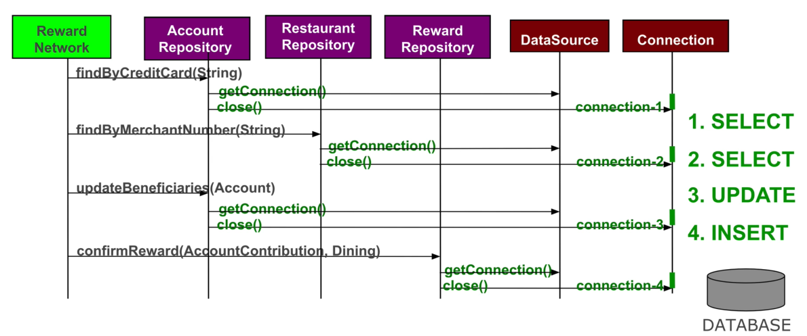
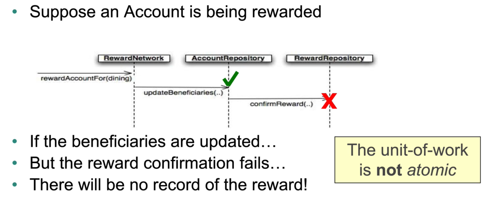
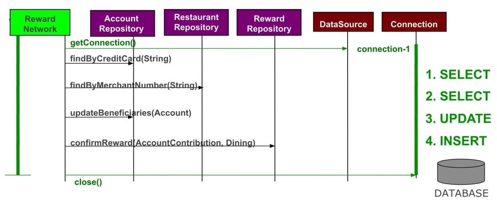
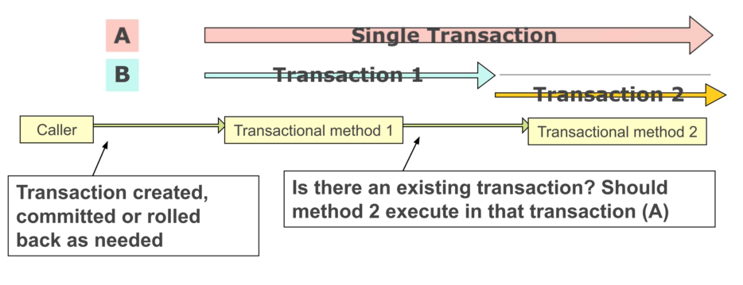

# Transactions

### Summary

- [Definition](#definition)
    - [Naive approach](#naive-approach)
- [Spring Transactions](#spring-transactions)
    - [Config](#config)
- [Propagation Rules](#propagation-rules)
    - [Config options](#config-options)
- [Rollback Rules](#rollback-rules)
    - [Testing](#testing)

#
<br>

## Definition

- A set of tasks taking place as a **single**, **indivisible** action.

- Follows the **ACID** principle.

- **Atomic** :

    - Each unit of work is an all-or-nothing operation.
    - Either everything *successes*, or everything *rollbacks* entirely.

- **Consistent** :

    - Database integrity contraints are never violated.

- **Isolated** :

    - Isolates transactions from each other.
    - Enable *concurrent* access to a *shared* resource.

- **Durable** :

    - Committed changes are permanent.

#
### Naive approach

*Ex :*



<br>

- This method rewards users for dining in a restaurant.
- It requires several access to the database for accounts and updating amounts.

<br>

**<u>Issues</u>** :

- Connection is made **per data access operation**.

- Each operation acquires, uses and releases a distinct connection.

- If one operation fails, the others **still proceed** nonetheless.

- This **unit of work** is *non-transactional*, as it violates **ACID** principles.

<br>

*Ex : **partial failure***



<br>

**<u>Improvements</u>** :



<br>

## Spring Transactions

- Separates transaction *demarcation* from *implementation*.

- Demarcation expressed programatically or through AOP.

- Implementation details are hidden and independent.

- Same API for local or global transaction.

- Transaction context is bound to current thread :

    - Holds the underlying JDBC connection, Hibernate session...
    - Holds a `JdbcTemplate`. 
    - Can be accessed from anywhere.

<br>

*Ex :*

`DataSourceUtils.getConnection(dataSource)` to manually get the current opened connection.

#
### Config

1. Declare a `PlatformTransactionManager` bean.

2. Declare **transactional methods** :

    - Declaratively through annotations.
    - Programmatically.
    - Both.

3. Add `@EnableTransactionManagement` to a configuration class.

<br>

*Ex :*

``` java
@Configuration
@EnableTransactionManagement
public class TxnConfig {
    @Bean
    public PlatformTransactionManager transactionManager(DataSource dataSource) {
        return new DataSourceTransactionManager(dataSource);
    }
}
```
``` java
// ...
@Transactional
public RewardConfirmation rewardAccountFor(Dining d) {
    // Atomic unit of work.
}
```
- `PlatformTransactionManager` is the base interface for the abstraction.

- Several implementations available and **loose-coupled** with application code : 

    - `DataSourceTransactionManager`
    - `JmsTransactionManager`
    - `JpaTransactionManager`
    - `JtaTransactionManager`

- Bean id should be `transactionManager`.

- Transactions are defined in unit of work (methods) through `@Transactional`.

- `@EnableTransactionManagement` defines a bean post processor to proxy `@Transactional` beans through an **around** advice.

- The connection is opened and closed around the method through the **proxy**.

- **Rollback** if a `RuntimeException` is thrown (default).

- **Behavior** can be configured.

- `@Transactional` can be applied to a class or interface to propagate to all methods.

    - Reapplying to a method allow to *override* the config.

- Java also have a transactional annotation :

    - `javax.transaction.Transactional`.
    - Fewer options.

<br>

## Propagation Rules

- Handling multiple *successive* transactions.

- What happens if a transactional method calls another transactional method ? Should the 2 transactions join, or the second one run while the first one waits ?

<br>



<br>

- Propagation rules are enforced by proxies, *ie* transactional **beans**.

*Ex :*

``` java
@Transactional(propagation=Propagation.REQUIRED)
public void update1() {
    update2();
}
// Rule not applied because call is internal.
@Transactional(propagation=Propagation.REQUIRED_NEW)
public void update2() {
    // ...
}
```
#
### Config options

> `@Transactional(propagation=Propagation.<propagation_type>)`

- `REQUIRED`

    - Default.
    - Merges into the existing transaction or creates one if none exists.

- `REQUIRE_NEW`

    - Creates a new transaction.
    - Suspends existing transactions.

<br>

## Rollback Rules

- By default, a transaction is rolled back **only** if a `RuntimeException` is thrown.

- Checked exception will not roll back, which can lead to partial failures (Spring *only* throws runtime exceptions).

- `rollbackFor` :

> `rollbackFor=<checked_exception.class>`

> `rollbackFor={<checked_exception_1.class, checked_exception_2.class> ...}`

- `noRollbackFor` :

> `noRollbackFor=<unchecked_exception.class>`

> `noRollbackFor={<unchecked_exception_1.class, unchecked_exception_2.class> ...}`

#
### Testing

- `@Transactional` can be used with `@Test` as well.

- Transactions will then *always* be **rolled back** at the end of the test.

- Transactions *within* an `@Test` method **will not be rolled back**. Only the annotated method transaction will.

- `@Commit` will force a commit at the end of a test and prevent auto rollbacks.