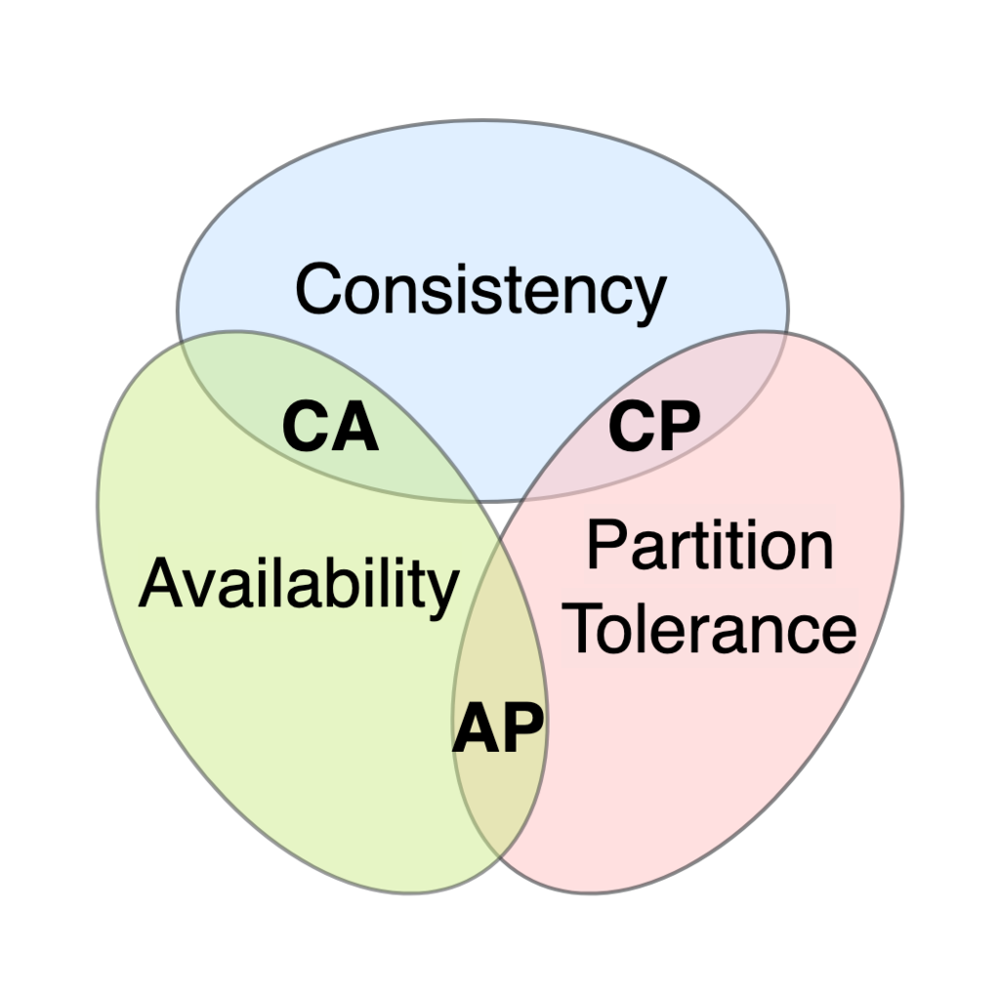
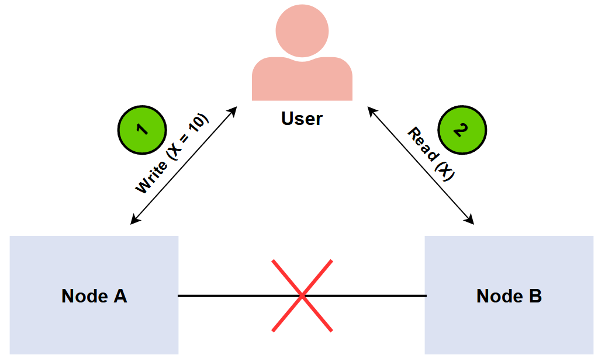

# CAP theorem

### Summary

- [Definition](#definition)
- [Explanation](#explanation)
- [NoSQL Databases for CAP](#nosql-databases-for-cap)
    - [CA Databases](#ca-databases)
    - [CP Databases](#cp-databases)
    - [AP Databases](#ap-databases)

## Definition

The CAP theorem states that a **distributed system** can only provide 2 of the following 3 properties simultaneously: 

- **Consistency**.
- **Availability**.
- **Partition tolerance**.

 

 

**<u>Consistency</u>**

- All nodes see the same data **simultaneously**.

- A read should return the most recent write operation result, *regardless* of the node being read. **Each node should return the same result**.

- When data is written to a single node, it is replicated across **all other nodes of the system**.

**<u>Availability</u>**

- The system remains operational **all of the time**. 

- Every request will get a response *regardless* of the individual state of the nodes. This means that the system will **operate even if multiple nodes are down**. 

- There’s no *guarantee* that the response will be the most recent write operation.

**<u>Partition tolerance</u>**

- Tolerant to **partitions** : breaks in communication between nodes.

- The system **does not fail**, regardless of whether messages are dropped or delayed between nodes within the system.

- The system must **replicate record**s across combinations of nodes and networks.

 

## Explanation

No distributed system is safe from network failures, thus network partitioning generally has to be tolerated.

In the presence of a **partition**, one is then left with two options: **consistency** or **availability**. 

**<u>Consistency over availability</u>** 

- Returns an error or timeout if a particular information cannot be guaranteed to be up to date due to network partitioning. 

**<u>Availability over consistency</u>**

- Always processes the query and try to return the most recent available version of the information, even if it cannot guarantee it is up to date due to network partitioning.

 

 

In the absence of a partition, both **availability** and **consistency** can be satisfied.

 

## NoSQL Databases for CAP

NoSQL databases are great for horizontal scaling. They can satisfy only 2 of the 3 CAP properties.

### CA Databases

Provides consistency and availability across all nodes.
Does not provide fault tolerance, which makes them not very practical.

Ex : **PostgreSQL** for relational databases, can be replicated across nodes.

### CP Databases

Provides consistency and partition tolerance across all nodes.

In case of a partition, **turn off inconsistent nodes until the partition can be fixed**.

Ex : **MongoDB** - Only one primary node receives all the write requests in a given replica set. Secondary nodes replicate the data in the primary nodes, so if the primary node fails, a secondary node can stand-in and ensure consistency.

### AP Databases

Provides availability and partition tolerance across all nodes.

In case of a partition, **all nodes are available**, but **they’re not all updated**.

When the partition is eventually resolved, sync the nodes to ensure consistency across them.

Ex : **CassandraDB** - No primary node, meaning that all of the nodes remain available.
Eventual consistency : data can be resynced after a partition is resolved. 