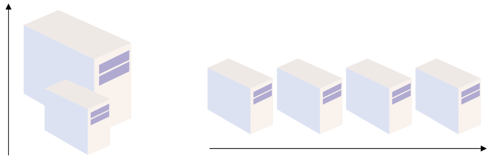
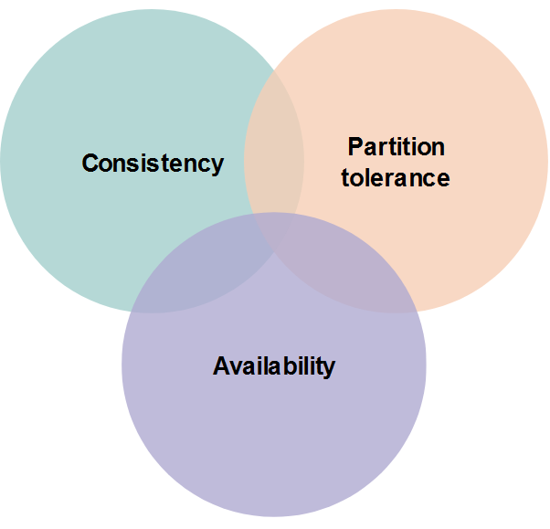
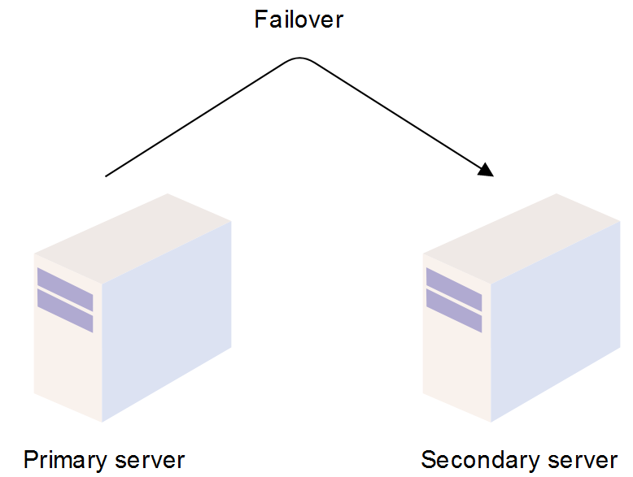

# System Design Fundamentals

### Summary

- [Horizontal and vertical scaling](#horizontal-and-vertical-scaling)
- [Microservices](#microservices)
- [Proxy servers](#proxy-servers)
    - [CAP theorem](#cap-theorem)
- [Redundancy and replication](#redundancy-and-replication)
    - [Redundancy](#redundancy)
    - [Replication](#replication)
- [Storage](#storage)
    - [Block storage](#block-storage)
    - [File storage](#file-storage)
    - [Object storage](#object-storage)
    - [Redundant Disk Arrays (RAID)](#redundant-disk-arrays-raid)
- [Message queues](#message-queues)
- [File systems](#file-systems)
    - [Google File System (GFS)](#google-file-system-gfs)
    - [Hadoop Distributed File System (HDFS)](#hadoop-distributed-file-system-hdfs)

---

 

System design is the process of defining the architecture, interfaces, and data for a system that satisfies specific requirements.

System design requires a **systematic** approach to building and engineering systems.
 
A good system design requires you to think about everything in an infrastructure, from the hardware and software, all the way down to the data and how it’s stored.

 

## Horizontal and vertical scaling

### Scalability

Application’s ability to handle and withstand an increased workload (through computational power) without sacrificing latency.

**Vertical scaling** -> Increases each server power but not capacity.

**Horizontal scaling** -> Increases the number of servers but not each server power.

 

There are tradeoffs for each type of scaling.

 

## Microservices

Microservices divides a large application into a collection of separate, modular services. These modules can be independently developed, deployed, and maintained.

Microservices operate at a much faster and more reliable speed than traditional monolithic applications.
  
Since the application is broken down into independent services, every service has its own logic, codebase, server. 

These services can communicate b/w each other with APIs.

**Advantages** : 

- Scalability.

 

## Proxy servers

A proxy server, or forward proxy, acts as a channel or gate between a user and the internet. It separates the end-user from the website they’re browsing, and transferts requests forth and back and possibly processing it before relay. 

Proxy servers not only relays requests but also provide many benefits, such as:

- Improved security
- Improved privacy
- Access to blocked resources
- Control of the internet usage of employees and children
- Cache data to speed up requests

### CAP theorem

The CAP theorem is a fundamental theorem within the field of system design. It states that a distributed system can only provide 2 of 3 properties simultaneously : consistency, availability, and partition tolerance. The theorem formalizes the tradeoff between consistency and availability when there’s a partition.

 

 

## Redundancy and replication

### Redundancy

- Duplicates critical components to increase the system reliability or overall performance. 
- Usually comes in the form of a backup or fail-safe. 
- Removes single points of failure in a system and provides backups when needed.

 

 

### Replication

- Shares information to ensure consistency between redundant resources.
- Software or hardware components can be replicated to improve reliability, fault-tolerance, or accessibility.
- Used in many database management systems (DBMS), typically with a primary-replica relationship between the original and its copies. The primary server receives all of the updates, and those updates pass through the replica servers. Each replica server outputs a message when it successfully receives the update.

 

## Storage

Data is at the center of every system. When designing a system, we need to consider how we’re going to store our data. 

There are various storage techniques that we can implement depending on the needs of our system.

### Block storage

Data is broken down into blocks of equal sizes, and each individual block is given a unique identifier for easy accessibility. 
 
These blocks are stored in physical storage. As opposed to adhering to a fixed path, blocks can be stored anywhere in the system, making more efficient use of the resources.

### File storage

Hierarchical storage methodology. The data is stored in files, folders, directories. 
This storage method is only good for a limited amount of data, primarily structured data.

*As the size of the data grows beyond a certain point, this data storage method can become a hassle.*

### Object storage

Designed to handle large amounts of unstructured data. 

Preferred data storage method for data archiving and data backups because it offers dynamic scalability. 

Object storage isn’t directly accessible to an operating system. Communication happens through RESTful APIs at the application level.

This type of storage provides immense flexibility and value to systems, because backups, unstructured data, and log files are important to any system. Used for system with large datasets.

### Redundant Disk Arrays (RAID)

Use multiple disks in concert to build a faster, bigger, and more reliable disk system.
 
Externally, a RAID looks like a disk. Internally, it’s a complex tool, consisting of multiple disks, memory, and one or more processors to manage the system. 

A hardware RAID is similar to a computer system but is specialized for the task of managing a group of disks. There are different levels of RAID, all of which offer different functionalities.

 

## Message queues

A FIFO (first in first out) queue that route messages between emitter and consumer. 

- Facilitates asynchronous behavior. 
- Facilitates cross-module communication.
- Provides temporary storage for messages until they are processed and consumed by the consumer.

**Kafka**

Apache Kafka started in 2011 as a messaging system for LinkedIn but has since grown to become a popular distributed event streaming platform. The platform is capable of handling trillions of records per day.

Kafka is a distributed system consisting of servers and clients that communicate through a TCP network protocol. The system allows to read, write, store, and process events. Kafka is primarily used for building **data pipelines** and implementing **streaming solutions**.

 

## File systems

File systems are processes that manage how and where data on a storage disk is stored. It manages the internal operations of the storage disk and explains how users or applications can access disk data. 

File systems manage multiple operations, such as:

- File naming
- Storage management
- Directories
- Folders
- Access rules

Without file systems, it would be hard to identify files, retrieve files, or manage authorizations for individual files.

### Google File System (GFS)

- Scalable distributed file system designed for large data-intensive applications, like Gmail or YouTube. 
- Built to handle batch processing on large data sets.
- Designed for system-to-system interaction, rather than user-to-user interaction. - - Scalable and fault-tolerant. 

The architecture consists of GFS clusters, which contain a single master and multiple ChunkServers that can be accessed by multiple clients.

### Hadoop Distributed File System (HDFS)

- Distributed file system that handles large sets of data and runs on commodity hardware.
- Built to store unstructured data.
- Simplified version of GFS. A lot of its architectural decisions are inspired by the GFS design. HDFS is built around the idea that the most efficient data processing pattern is a “write once, read many times” pattern.