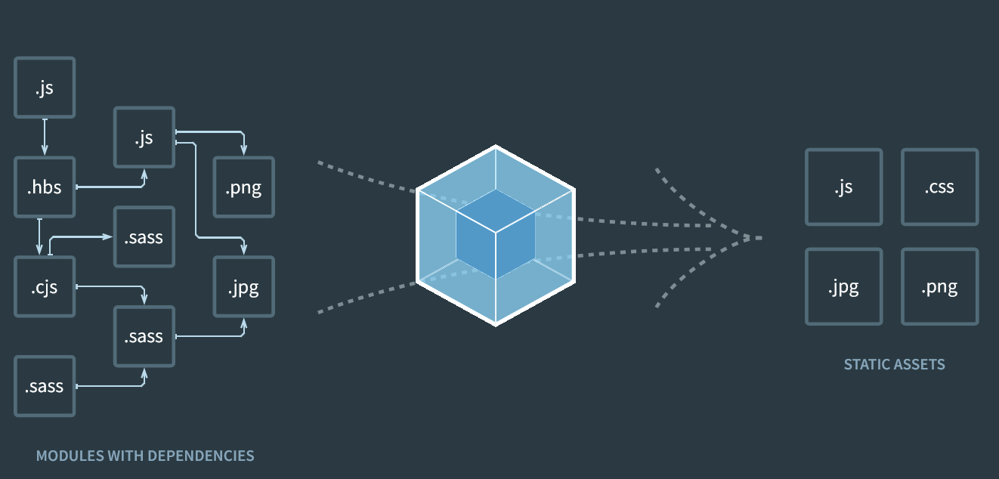

# Webpack

### Summary

- [Overview](#overview)
- [Modules](#modules)
- [Configuration](#configuration)
    - [Entry point](#entry-point)
    - [Output](#output)
    - [Loader](#loader)
    - [Mode](#mode)

#
<br>

## Overview

- **Static module bundler** for Javascript applications.

- Builds a **dependency graph** from several entry points.

- Combine modules into **bundles** : static assets to serve content from.

- Modules are specified in the command line or in the **configuration file**.

<br>



[ module -> ... -> module ] ------------------------------------------------------> [ **output** folder ]

<br>

## Modules

- File or chunk of code that encapsulates a concept or functionality.

- Modules can be : 

    - **ECMAScript** modules.
    - **CommonJS** modules.
    - **AMD** modules.
    - **Assets** (images, icons...).
    - **WebAssembly** modules.

- Each module may depends on code from other modules (ex : function importing an image). This is called a **dependency**.

- A module will not load or will throw an error if its dependencies are not available.

- Dependencies thus have to be **resolved**.

<br>

*Example of resolving dependencies without using modules by loading scripts in order* :

``` js
<!DOCTYPE html>
<html lang="en">
    <head>
        <meta charset="utf-8">
        <title>Backbone.js Todos</title>
        <link rel="stylesheet" href="main.css"/>
    </head>

    <body>
        <script src="../../test/vendor/json2.js"></script>
        <script src="../../test/vendor/jquery.js"></script>
        <script src="../../test/vendor/underscore.js"></script>
        <script src="../../backbone.js"></script>
        <script src="../backbone.localStorage.js"></script>
        <script src="main.js"></script>
    </body>

    <!-- (...) -->

</html>
```
<br>

## Configuration

- No configuration file needed by default :
    - Assumes default entry point : `./src/index.js`.
    - Assumes default output : `./dist/main.js`.

- A configuration file can be provided in the root folder, as a **module**.

- Assumes default name `webpack.config.js`.

<br>

**Bad configuration practices** :

- Accessing CLI arguments, when using the webpack CLI.

- Exporting non-deterministic values (each call should result in the same output files).

- Write long configurations (instead split the configuration into multiple files).

#
### Entry point

- Starting module to build the dependency graph upon.

- Usually a root module, by default `./src/index.js`.

<br>

*Ex :*

**webpack.config.js**

``` js
module.exports = {
    // ...
    entry: './<relative_path>.js',
    // ...
};
```
#
### Output

- Destination directory to emit the bundles.

- Name of emitted bundles.

- By default `./dist/main.js`.

<br>

*Ex :*

**webpack.config.js**

``` js
const path = require('path');

module.exports = {
    // ...
    output: {
        path: path.resolve(__dirname, 'dist'),
        filename: '<file_name>.js',
    },
    // ...
};
```
#
### Loader

- By default webpack can only read **Javascript** & **JSON** files.

- Loaders allow webpack to process files in other formats.

<br>

*Ex :*

**webpack.config.js**

``` js
module.exports = {
    // ...
    module: {
        rules: [{ test: /\.txt$/, use: 'text-loader' }],
    },
    // ...
};
```
- When coming across a path resolving to a `.txt` while importing a module, tells the compiler to use the provided loader to transform the file before adding to the bundle.

#
### Mode

- Sets mode to `'none' | 'development' | 'production'`.

- Enables built-in optimizations for each mode.

<br>

*Ex :*

**webpack.config.js**

``` js
module.exports = {
    // ...
    mode: 'production',
    // ...
};
```